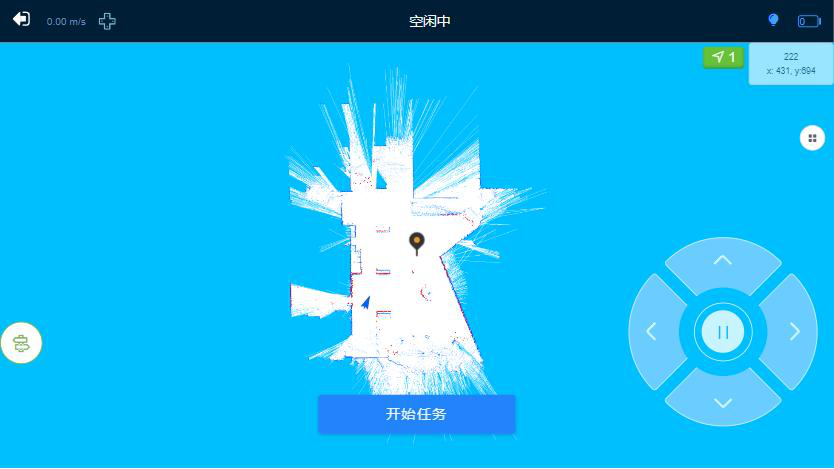
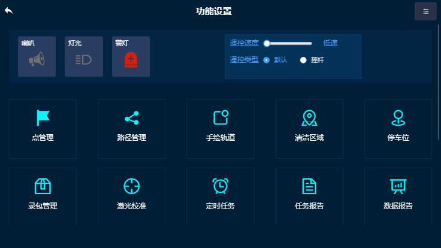
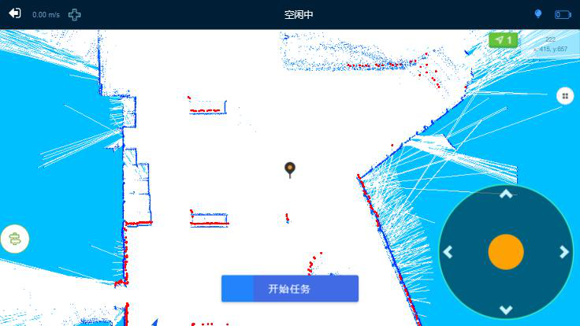
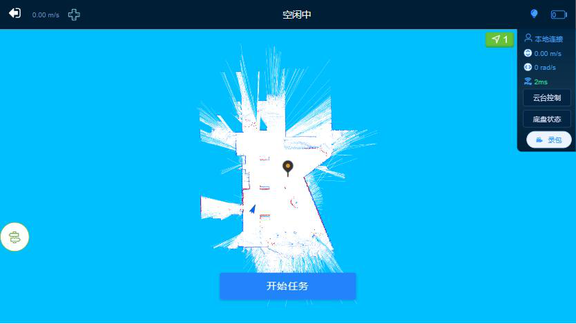
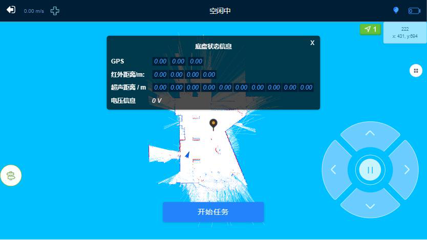
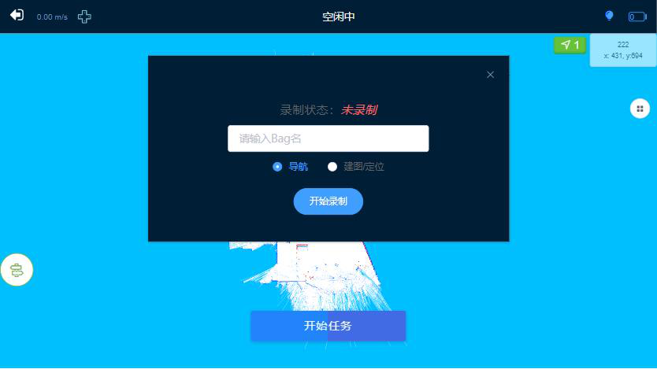
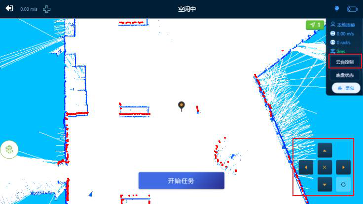

# 状态显示与控制

## 控制机器人移动

1. 在APP首页，点击界面上方的遥控图标按钮，右下角会弹出一个控制机器人移动的遥控窗口
   

2. 遥控操作：
   - 通过点击方向按钮来控制机器人前后左右移动
   - 中间按钮为急停按钮，可以控制机器人停止移动
   - 每多点击一次方向按钮，都会使得机器人移动速度等级上升或者下降一个等级

3. 遥控速度调整：
   - 在APP首页，点击点管理图标，进入到【功能设置】界面，点击右上角展开图标
   
   - 遥控速度设置：高速为1.2 m/s，低速为0.6 m/s（默认为低速）

4. 遥控类型：
   - 在隐藏设置区，可将遥控器切换为摇杆类型（默认为箭头遥控器）
   

## 机器人信息显示

在APP首页，点击界面上方的信息显示图标，能获取机器人的移动速度，显示转向角，电量等信息

信息图标说明：
- 机器人名称
- 当前机器人速度
- 当前机器人旋转角度
- 实时显示网络信号
- 显示/隐藏云台控制遥控器
- 查看机器人的底盘状态
- 录制包的图标

## 底盘状态

在APP首页，点击界面上方的信息显示图标，在弹框中点击【底盘状态】按钮，可以显示机器人的GPS、每个红外线状态和距离、超声波状态和距离、电压信息

## 录包

在APP首页，点击界面上方的信息显示图标，在弹框中点击录包图标，弹出录包界面

录包功能说明：
- 录包的功能在于发现问题后，可以将录制的包发送给工作人员，方便快速发现问题
- 录制包时，需要在点击【开始建图】之前，先对录包进行操作
- 当录制图标为红色时，表示正在录包

录包类型：
- **导航模式**：地图和导航的包全部都进行录制
- **建图/定位**：当机器人发生定位不准确时，可进行录制

## 云台控制

在APP首页，点击界面上方的信息显示图标，在弹框中点击【云台控制】按钮，右下角会弹出一个云台控制遥控器

云台控制操作：
- 通过点击方向按钮来控制云台上下左右转动
- 中间按钮为停止转动
- 右下角为云台复位按钮

## 外接设备控制

喇叭、灯光、警灯控制：
1. 在APP首页，点击点管理图标，进入到【功能设置】界面
2. 点击右上角展开图标，展开隐藏设置区
3. 点击相应图标按钮，控制喇叭、灯光、警灯开关

## 音频收藏

1. 在APP首页，点击点管理图标，选择【音频收藏】，可以查看已上传的音频列表
2. 点击【播放】可以播放该音频，同时能播放多个音频
3. 点击右上角【停止】，可以停止所有播放声音
4. 上传音频：点击顶部右上角【上传】，选择移动设备文件夹中的.wav格式音频 