注意事项

一、请注意安装和拆卸时不要损伤激光雷达镜面。

二、请按照操作指南的指示使用产品。因不当使用导致的任何损失及伤害，本

> 公司概不负责。

三、机器人的外壳不能搬运受力，放置重物以及敲击。

四、防止损坏设备及违反保修条款，请勿私自拆卸机器人本体。

五、机器人运行时，请勿遮挡传感器和激光雷达。

六、在机器人运行前，若行驶路径经过减速带或路面坑洼不平地段，

七、请提前在地图管理中编辑减速区，避免机器人高速驶过产生事故。

八、禁止在极高(50°C)或极低(-20°C)的环境中使用该产品，可能会引起设备

> 故障。

九、请使用本公司专配的原装可充电电池及充电桩。

十、禁止在潮湿或者有积水的地面使用产品。

十一、谨慎使用充电桩避免其损坏。

十二、充电桩附近不要有物体遮挡，以防止设备无法正常准确到达充电桩位置。

十三、若长时间不使用产品，请将产品关机。

1

> 目 录

1
连接机器人\...\...\...\...\...\...\...\...\...\...\...\...\...\...\...\...\...\...\...\...\...\...\...\...\...\...\...\...\...\...\...\...\...\...\...\...\...\...\...\...\...\...\...\...\...\...\...\...\...\...\...\...\....
2 1.1
通过内网连接：\...\...\...\...\...\...\...\...\...\...\...\...\...\...\...\...\...\...\...\...\...\...\...\...\...\...\...\...\...\...\...\...\...\...\...\...\...\...\...\...\...\...\...\...\...\.....2
2
地图相关操作\...\...\...\...\...\...\...\...\...\...\...\...\...\...\...\...\...\...\...\...\...\...\...\...\...\...\...\...\...\...\...\...\...\...\...\...\...\...\...\...\...\...\...\...\...\...\...\...\...\...\...\...
4 2.1
建图\...\...\...\...\...\...\...\...\...\...\...\...\...\...\...\...\...\...\...\...\...\...\...\...\...\...\...\...\...\...\...\...\...\...\...\...\...\...\...\...\...\...\...\...\...\...\...\...\...\...\...\...\.....
4 2.2
建图录点\...\...\...\...\...\...\...\...\...\...\...\...\...\...\...\...\...\...\...\...\...\...\...\...\...\...\...\...\...\...\...\...\...\...\...\...\...\...\...\...\...\...\...\...\...\...\...\...\...\...\....7
2.3
继续建图（暂未开放）\...\...\...\...\...\...\...\...\...\...\...\...\...\...\...\...\...\...\...\...\...\...\...\...\...\...\...\...\...\...\...\...\...\...\...\...\...\...\...\...\...\...\....8
2.4
建图规则及建议\...\...\...\...\...\...\...\...\...\...\...\...\...\...\...\...\...\...\...\...\...\...\...\...\...\...\...\...\...\...\...\...\...\...\...\...\...\...\...\...\...\...\...\...\...\...\....8
2.5
编辑虚拟墙\...\...\...\...\...\...\...\...\...\...\...\...\...\...\...\...\...\...\...\...\...\...\...\...\...\...\...\...\...\...\...\...\...\...\...\...\...\...\...\...\...\...\...\...\...\...\...\...\...\...8
2.6
编辑障碍物\...\...\...\...\...\...\...\...\...\...\...\...\...\...\...\...\...\...\...\...\...\...\...\...\...\...\...\...\...\...\...\...\...\...\...\...\...\...\...\...\...\...\...\...\...\...\...\...\....11
3
导航相关操作\...\...\...\...\...\...\...\...\...\...\...\...\...\...\...\...\...\...\...\...\...\...\...\...\...\...\...\...\...\...\...\...\...\...\...\...\...\...\...\...\...\...\...\...\...\...\...\...\...\...\....
12 3.1
位置初始化\...\...\...\...\...\...\...\...\...\...\...\...\...\...\...\...\...\...\...\...\...\...\...\...\...\...\...\...\...\...\...\...\...\...\...\...\...\...\...\...\...\...\...\...\...\...\...\...\....13
3.2
录点\...\...\...\...\...\...\...\...\...\...\...\...\...\...\...\...\...\...\...\...\...\...\...\...\...\...\...\...\...\...\...\...\...\...\...\...\...\...\...\...\...\...\...\...\...\...\...\...\...\...\...\...\...
14 3.3
手绘点\...\...\...\...\...\...\...\...\...\...\...\...\...\...\...\...\...\...\...\...\...\...\...\...\...\...\...\...\...\...\...\...\...\...\...\...\...\...\...\...\...\...\...\...\...\...\...\...\...\...\...\...15
3.4
手绘轨道\...\...\...\...\...\...\...\...\...\...\...\...\...\...\...\...\...\...\...\...\...\...\...\...\...\...\...\...\...\...\...\...\...\...\...\...\...\...\...\...\...\...\...\...\...\...\...\...\...\.....16
3.5
录路径\...\...\...\...\...\...\...\...\...\...\...\...\...\...\...\...\...\...\...\...\...\...\...\...\...\...\...\...\...\...\...\...\...\...\...\...\...\...\...\...\...\...\...\...\...\...\...\...\...\...\...\...18
3.6
手绘路径\...\...\...\...\...\...\...\...\...\...\...\...\...\...\...\...\...\...\...\...\...\...\...\...\...\...\...\...\...\...\...\...\...\...\...\...\...\...\...\...\...\...\...\...\...\...\...\...\...\.....19
3.7
创建任务\...\...\...\...\...\...\...\...\...\...\...\...\...\...\...\...\...\...\...\...\...\...\...\...\...\...\...\...\...\...\...\...\...\...\...\...\...\...\...\...\...\...\...\...\...\...\...\...\...\.....20
3.8
跑任务\...\...\...\...\...\...\...\...\...\...\...\...\...\...\...\...\...\...\...\...\...\...\...\...\...\...\...\...\...\...\...\...\...\...\...\...\...\...\...\...\...\...\...\...\...\...\...\...\...\...\...\...21
3.9
定时任务\...\...\...\...\...\...\...\...\...\...\...\...\...\...\...\...\...\...\...\...\...\...\...\...\...\...\...\...\...\...\...\...\...\...\...\...\...\...\...\...\...\...\...\...\...\...\...\...\...\.....23
3.10
任务报告\...\...\...\...\...\...\...\...\...\...\...\...\...\...\...\...\...\...\...\...\...\...\...\...\...\...\...\...\...\...\...\...\...\...\...\...\...\...\...\...\...\...\...\...\...\...\...\...\...\...24
4
系统相关\...\...\...\...\...\...\...\...\...\...\...\...\...\...\...\...\...\...\...\...\...\...\...\...\...\...\...\...\...\...\...\...\...\...\...\...\...\...\...\...\...\...\...\...\...\...\...\...\...\...\...\...\...\...
25 4.1
参数配置\...\...\...\...\...\...\...\...\...\...\...\...\...\...\...\...\...\...\...\...\...\...\...\...\...\...\...\...\...\...\...\...\...\...\...\...\...\...\...\...\...\...\...\...\...\...\...\...\...\....
25 4.2
录包管理\...\...\...\...\...\...\...\...\...\...\...\...\...\...\...\...\...\...\...\...\...\...\...\...\...\...\...\...\...\...\...\...\...\...\...\...\...\...\...\...\...\...\...\...\...\...\...\...\...\....
26 4.3
系统信息\...\...\...\...\...\...\...\...\...\...\...\...\...\...\...\...\...\...\...\...\...\...\...\...\...\...\...\...\...\...\...\...\...\...\...\...\...\...\...\...\...\...\...\...\...\...\...\...\...\....
27 5
状态显示与控制\...\...\...\...\...\...\...\...\...\...\...\...\...\...\...\...\...\...\...\...\...\...\...\...\...\...\...\...\...\...\...\...\...\...\...\...\...\...\...\...\...\...\...\...\...\...\...\...\...\...27
5.1
控制机器人移动\...\...\...\...\...\...\...\...\...\...\...\...\...\...\...\...\...\...\...\...\...\...\...\...\...\...\...\...\...\...\...\...\...\...\...\...\...\...\...\...\...\...\...\...\...\....27
5.2
机器人信息显示\...\...\...\...\...\...\...\...\...\...\...\...\...\...\...\...\...\...\...\...\...\...\...\...\...\...\...\...\...\...\...\...\...\...\...\...\...\...\...\...\...\...\...\...\...\....29
5.3
底盘状态\...\...\...\...\...\...\...\...\...\...\...\...\...\...\...\...\...\...\...\...\...\...\...\...\...\...\...\...\...\...\...\...\...\...\...\...\...\...\...\...\...\...\...\...\...\...\...\...\...\....
30 5.4
录包\...\...\...\...\...\...\...\...\...\...\...\...\...\...\...\...\...\...\...\...\...\...\...\...\...\...\...\...\...\...\...\...\...\...\...\...\...\...\...\...\...\...\...\...\...\...\...\...\...\...\...\...\...
30 5.5
云台控制\...\...\...\...\...\...\...\...\...\...\...\...\...\...\...\...\...\...\...\...\...\...\...\...\...\...\...\...\...\...\...\...\...\...\...\...\...\...\...\...\...\...\...\...\...\...\...\...\...\....
31 5.6
外接设备控制\...\...\...\...\...\...\...\...\...\...\...\...\...\...\...\...\...\...\...\...\...\...\...\...\...\...\...\...\...\...\...\...\...\...\...\...\...\...\...\...\...\...\...\...\...\...\.....32
5.7
音频收藏\...\...\...\...\...\...\...\...\...\...\...\...\...\...\...\...\...\...\...\...\...\...\...\...\...\...\...\...\...\...\...\...\...\...\...\...\...\...\...\...\...\...\...\...\...\...\...\...\...\....
32 6
操作流程\...\...\...\...\...\...\...\...\...\...\...\...\...\...\...\...\...\...\...\...\...\...\...\...\...\...\...\...\...\...\...\...\...\...\...\...\...\...\...\...\...\...\...\...\...\...\...\...\...\...\...\...\...\...
32 7
常见故障分析\...\...\...\...\...\...\...\...\...\...\...\...\...\...\...\...\...\...\...\...\...\...\...\...\...\...\...\...\...\...\...\...\...\...\...\...\...\...\...\...\...\...\...\...\...\...\...\...\...\...\....
34

1

APP 操作指南

**1** 连接机器人

1.1 通过内网连接：

> \(1\) 使用默认配置，进行内网连接：
>
> ● 通过手机或平板连接上机器人无线WIFI，WIFI 密码为:12345678，如图1-1。

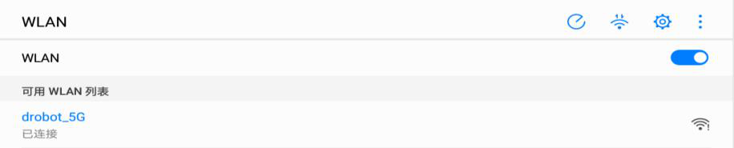{width="4.330554461942257in"
height="0.8736100174978128in"}

图1-1

> ● 连接上机器人WIFI 后，打开机器人操作平台APP，如图1-2。

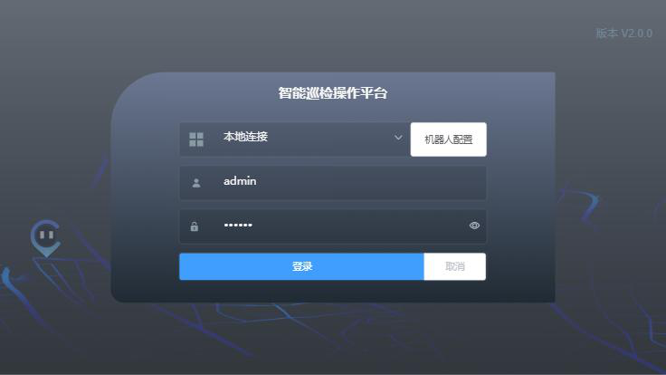{width="4.330554461942257in"
height="2.4361100174978128in"}

图1-2

> ● 在登录界面的选择机器人名称栏，选择"本地连接"选项，就可以正常登录，且
>
> 每次退出到登录界面时，都会默认选择"本地连接"选项。
>
> \(2\) 使用自定义配置，进行内网连接：
>
> ● 通过手机或者平板连接上机器人本身的无线WIFI，WIFI
> 密码为:12345678，如图
>
> 1-1
>
> ● 连接上机器人WIFI，打开机器人操作平台APP，如图1-2

2

> ● 通过配置机器人IP
> 和端口来连接机器人，步骤如下:点击【机器人配置】，进入
> 到设备配置界面，如图1-3
>
> 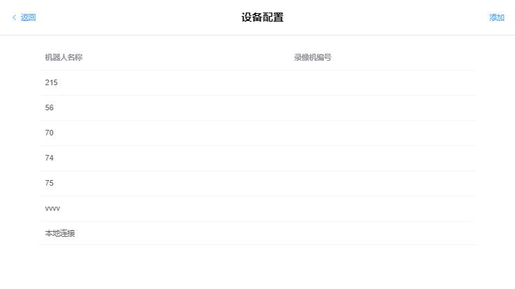{width="4.330554461942257in"
> height="2.436111111111111in"}
>
> 图1-3\
> 点击【添加】按钮，输入机器人名称、IP、端口后，点击【确定】，如图1-4
>
> 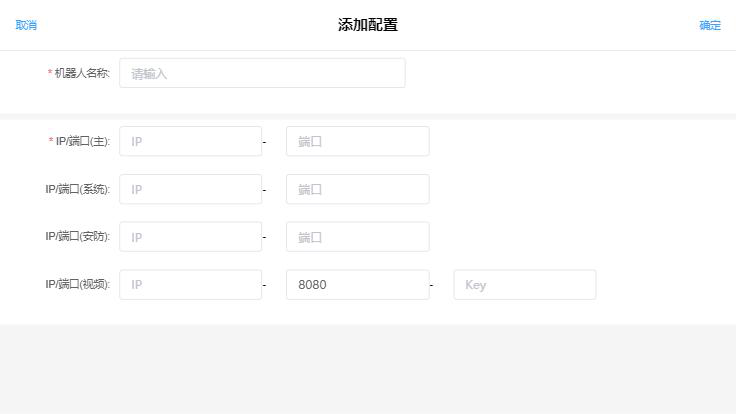{width="4.330554461942257in"
> height="2.436111111111111in"}
>
> 图1-4\
> 添加完成后点击【返回】就可以退出设备配置界面，在图1-2
> 界面选择添加的机器名称，填写用户名：admin;密码：123456，填写完成后点击登录，进入到APP
> 首页，如图1-5

3

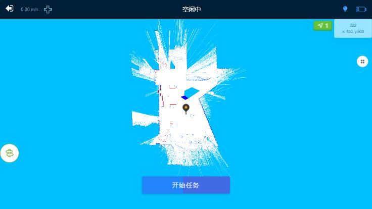{width="4.330554461942257in"
height="2.436111111111111in"}

图1-5\
若连接WIFI 后APP 无法连接登录控制器，可以尝试修改WIFI
连接方式为静态连接/手动设置。并将ip 地址设置为192.168.1.210,
子网掩码为255.255.255.0,路由器设置为192.168.1.1,dns
设置为8.8.8.8。为防止地址冲突，ip 地址最好设置为200-255 之间。

**2** 地图相关操作

**2.1** 建图

+-----------------------+-----------------------+-----------------------+
| 1\.                   | > 点击在APP           | 图标按钮，弹出        |
|                       | > 首页上方            | 遥控窗口后，通过右侧  |
|                       | 的{width="0 |                       |
|                       | .19722222222222222in" |                       |
|                       | > height="0.          |                       |
|                       | 20833333333333334in"} |                       |
+=======================+=======================+=======================+
+-----------------------+-----------------------+-----------------------+

> 到一定的位置;

+-----------------------+-----------------------+-----------------------+
| 2\.                   | > 点                  | > 图标按钮，如图2-1   |
|                       | 击{width="0 |                       |
|                       | .19722222222222222in" |                       |
|                       | > height="0           |                       |
|                       | .2013888888888889in"} |                       |
+=======================+=======================+=======================+
+-----------------------+-----------------------+-----------------------+

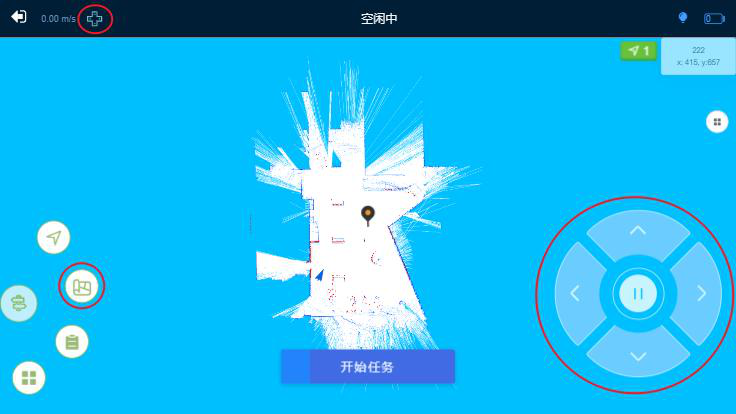{width="4.330554461942257in"
height="2.4375in"}

图2-1

4

进入到【选择地图】功能界面，点击右上角【建图】，如图2-2

> {width="4.330554461942257in"
> height="2.4361100174978128in"}

图2-2跳转到【创建地图】功能界面，如图2-3;

> 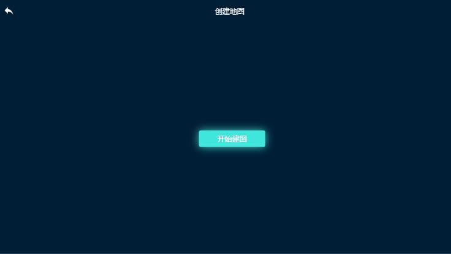{width="4.330554461942257in"
> height="2.4361100174978128in"}

图2-3\
3. 点击【开始建图】，将进入图2-4
的建图初始化界面，地图上外围红色点为激光点数
据；开始扫描时机器人的起始位置将记录为地图的原点，并且成为地图的origin
初始 点。

5

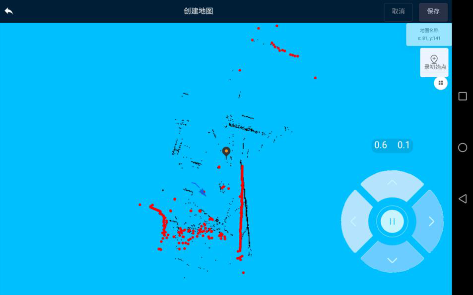{width="4.330554461942257in"
height="2.7055555555555557in"}

图2-4\
4.
通过界面上的遥控器遥控机器人行走，机器人会通过激光自动生成行走环境的地图界
面。当控制机器人走完需要扫描的环境时，点击遥控界面中间的停止按钮使得机器人停
住，然后再点击界面右上角【保存】按钮，并输入地图名字（英文字母和数字），点击
确认（如图2-5），系统便会对扫描的地图进行优化和保存，建图完成后，会自动跳转到
【选择地图】功能界面。

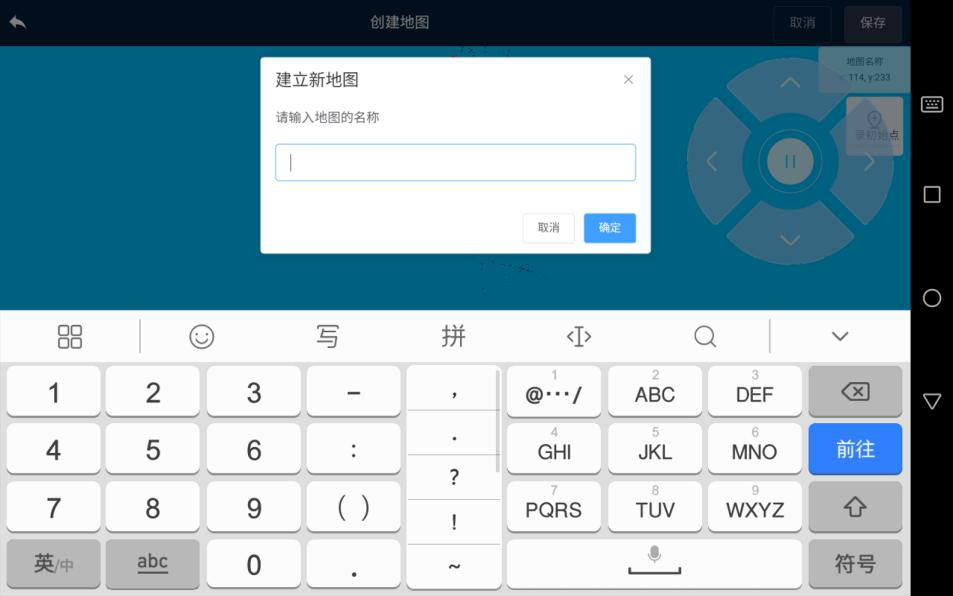{width="4.330554461942257in"
height="2.7055555555555557in"}

图2-5\
5.
建好的图中，深蓝色表示激光扫描时反馈的障碍物，浅蓝色表示激光未扫描区域，白色
表示无障碍，灰色线条表示激光扫描时反馈的路沿。注：路沿只有使用3D
激光建图时才 有，如图2-6。

6

> 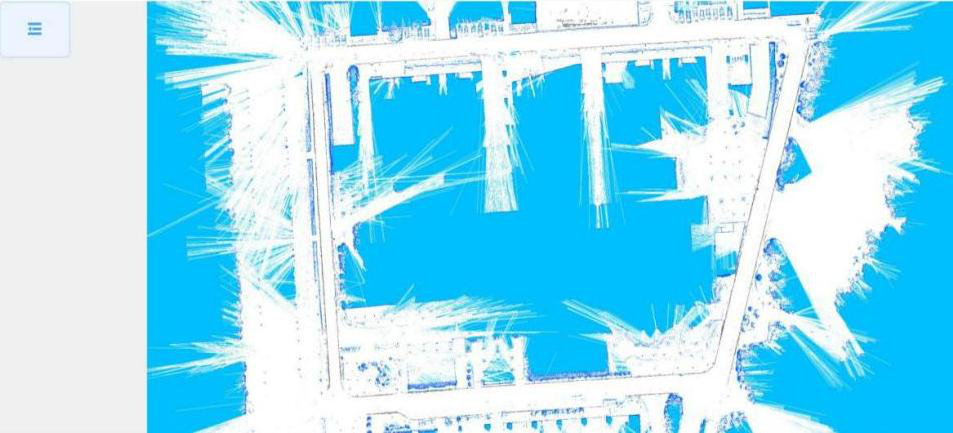{width="4.330554461942257in"
> height="1.9680544619422573in"}

图2-6

**2.2** 建图录点

建图录点功能可以在建图过程中，进行录制点，录制的点可用于导航，定位，绘制轨道，该功能目前只适用于3D
激光，主要操作步骤如下：\
1. 在APP
首页，进入到【选择地图】界面，点击右上角【建图】按钮，跳转到【创建地图】
功能界面。

2\.
点击【开始建图】，通过界面上的遥控器遥控机器人行走，在需要录点的地方将机器人
停下。

3\.
点击【录初始点】，输入点名称后，点击确定，就可以录制成功了，如图2-7。当建图完
成后选择该地图时，就可以看到录制点。

> 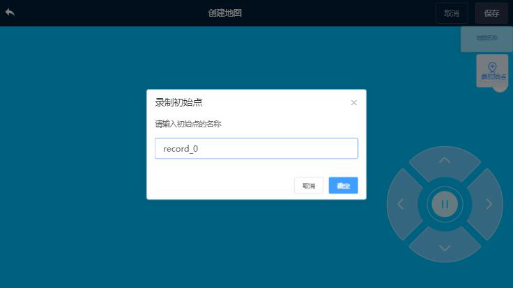{width="4.329166666666667in"
> height="2.4361100174978128in"}

图2-7\
4.
通过录制点连接来绘制轨道将更为准确，因此若想要绘制更合理的轨道，就必须在建图
完成后，再遥控车子到相应的位置录制点，才能完成轨道绘制，为了节省时间以及避免

7

> 重复操作，我们可以建图时在需要录点的地方，将车子停下进行录点，录点完成后，再继续遥控车子移动进行建图。注意：此功能只对于3D
> 激光有效，并且录的点与点之间可以正常连接起来，注意事项在手绘轨道功能有详细描述。

**2.3** 继续建图（暂未开放）

(注：该功能仅限于2D 环境！)\
继续建图是指可以在原始地图的基础上，进行继续建图，继续建图前，需要先把机器人移动到继续建图时的初始位置，激光和小车的方向与原始的地图可以进行初始化。

**2.4** 建图规则及建议

1\. 建图必须走一个完整的回环，即建图时机器人行走路径要形成一个完整闭环。

2\. 分叉路多和环路多的环境，要先闭小环后闭大环。

3\. 建图起始点尽量不要旋转。

4\. 结束点选择在之前走过的路径上, 且在结束点也尽量不旋转.
若结束点在起始点附近, 则可以将结束点选择超过起始点的位置。

5\. 操作人员尽量站在机器人后方。

6\.
其它相关人员在建图时尽量不要站在机器人前方，否则建图时容易将其当做固定障碍物
添加到地图。

7\.
转弯地方尽量慢点旋转，能直线行走尽量选择直线，走弧线的可以用直线行走加原地旋
转替代。

8\. 在建图时如果是使用3D
建图需要在系统更新里面修改建图环境参数0（室内）和1（室 外）。

**2.5** 编辑虚拟墙

编辑地图主要是对已建好的地图进行再次编辑修改，其中编辑虚拟墙功能用于对地图功能区进行管理，使机器人导航到对应功能区后进行对应的操作。编辑虚拟墙功能区主要有六种类型：\
●
虚拟墙：在地图中有玻璃墙、透光等激光无法识别的墙或者物品，有易碎物体、台阶或

8

> 者或不想让机器人通过的地方，设置一道虚拟的屏障，让机器人不会通过该区域。

● 坡道：机器人导航到该区域前会减速。

●
十字路口：机器人行驶到该区域会对红绿灯进行检测，红灯停绿灯行。注：需要单独搭
载红绿灯检测模块。

● 减速区：机器人导航到该区域时进行减速。

●
不避障区：机器人导航到该区域时，若遇到障碍物，机器人停止，但不会进行避障绕行，
直到前方安全再继续前进。

● 避障区：机器人导航到该区域时，会将该区域视为障碍物，进行避障绕行。

1\. 操作步骤：在APP
首页，进入到【选择地图】功能界面，点击右侧【编辑】按钮，如图

> 2-8

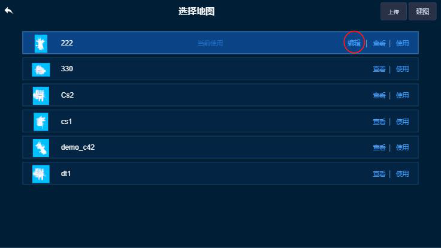{width="4.330554461942257in"
height="2.436111111111111in"}

图2-8

进入【编辑地图】功能界面，如图2-9

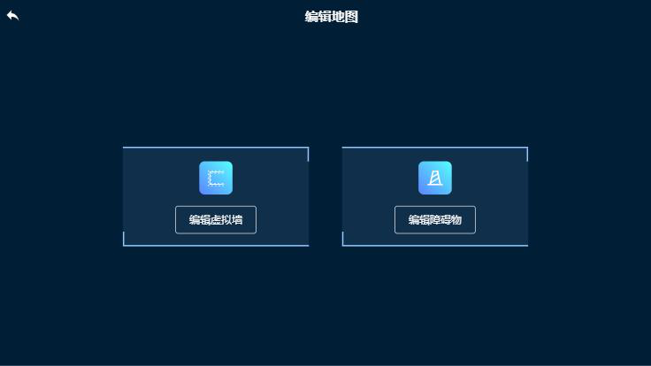{width="4.330554461942257in"
height="2.4361100174978128in"}

图2-9

选择【编辑虚拟墙】，进入编辑虚拟墙主界面，如图2-10。

9

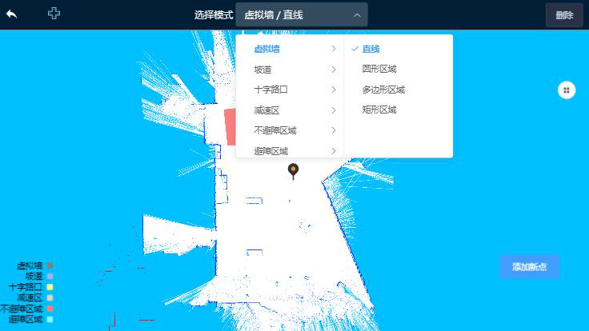{width="4.330554461942257in"
height="2.436111111111111in"}

图2-10\
在上方可以选择模式，包括虚拟墙、坡道、十字路口、减速区、不避障区域、避障区域，在选择虚拟墙模式中有直线，多边形，矩形，圆形四种类型的虚拟墙：

+-----------------------+-----------------------+-----------------------+
| ●                     | > 直线:               | >                     |
|                       |                       |  在地图上确定直线的起 |
|                       |                       | 点和终点。选择直线后  |
|                       |                       | ，拖动地图到合适的位  |
+=======================+=======================+=======================+
+-----------------------+-----------------------+-----------------------+

> 置，使得黑色图钉位于需要绘制虚拟墙的起点，点击右侧的【添加新点】按钮，拖动地图让图钉位于需要绘制虚拟墙的终点，点击右侧【连接点到】按钮，可绘制一条直线虚拟墙如图2-11。若该虚拟墙符合要求，点击完成按钮即可将虚拟墙保存。
>
> 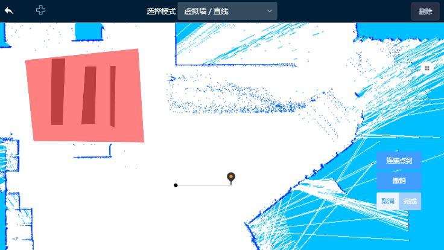{width="4.330554461942257in"
> height="2.4361100174978128in"}
>
> 图2-11\
> ● 多边形:在地图上确定多边形的多个顶点即可；\
> ● 矩形:在地图上确定矩形的两个对角点；\
> ● 圆形:在地图上确定圆形的圆心，拖动地图确定圆形的半径。

2\.
选择模式为坡道时，将图中的红点移动到需要画虚拟墙的位置，点击右侧添加新点，在
地图上确定多边形的多个顶点即可，连接完成后，点击【完成】按钮，即可对虚拟墙进

10

> 行保存(如图2-12 中深灰色区域)；模式为十字路口(如图2-12
> 中黄色区域)和减速区(如图2-12 中浅灰色区域)的操作与之相同。

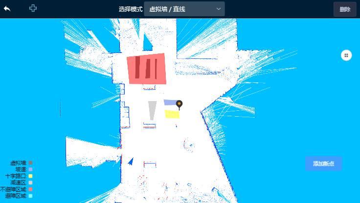{width="4.330554461942257in"
height="2.436111111111111in"}

图2-12

3\. 删除虚拟墙:如需删除虚拟墙，只需在图中点击选中该虚拟墙(如图2-13
虚拟墙选中后为 绿色)，再点击右上角的删除按钮，即可删除虚拟墙。

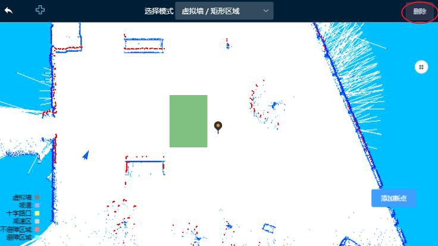{width="4.330554461942257in"
height="2.4361100174978128in"}

图2-13

**2.6** 编辑障碍物

由于建图时，室外情况下人和车较大，会有地图噪点或有些障碍物无法识别，我们就可以对地图进行清除噪点，或者手动添加障碍物。

在APP
首页，点击进入【选择地图】功能界面，点击右侧【编辑】按钮，进入【编辑地图】功能界面，选择【编辑障碍物】，就可以进入【编辑障碍物】主界面。如下图2-14。

11

> 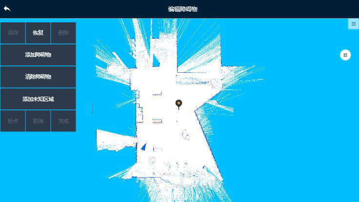{width="4.330555555555556in"
> height="2.436111111111111in"}

图2-14\
左测选项可手动添加障碍物、清除障碍物、添加未知区域，如果不小心添加或者清除地图的位置错误，可以点击【恢复】按钮，恢复到原始的地图。

> 下面举例添加障碍物步骤：
>
> （1）点击添加障碍物,标点功能亮起。

（2）把黑色图钉移动到没有扫描到障碍物的地方，点击【标点】，然后在需要添加障碍物的区域移动图钉多次点击【标点】。

（3）标点完成后，点击【完成】按钮，在右侧列表中会显示出已添加的障碍物区域，可以添加多个障碍物区域。注：目前不支持同时添加障碍物和清除障碍物，需先添加障碍物保存后，在进行清除障碍物。

> （4）点击【保存】按钮，在地图上就可以显示出已经添加的障碍物。

在使用3D
激光建图完成之后，图中会默认存在路沿，可以使用编辑障碍物功能清除路沿。注：路沿是为了更好的显示和控制机器人所行驶的路径。

**3** 导航相关操作

建图完成并编辑好地图，即可让机器人开始执行导航相关操作。导航相关操作主要包括位置初始化、录点、录路径、跑任务、手绘点、手绘轨道、手绘路径、新建任务等操作,这些操作都需要在进入相应的菜单后首先选择需要的地图才能操作。

12

⮚ 位置初始化：使机器人在地图中正确定位。

⮚ 录点：录制机器人此时所在位置的方位与坐标点。

⮚ 手绘点：通过拖动地图可人为在地图内选择任意点和任意方位。

⮚ 手绘轨道：为导航系统添加轨道，辅助导航路径生成。

⮚ 录路径：录制机器人实际行走的路径。

⮚
手绘路径：通过拖动地图人为选择任意两个点，之间便会形成路径（中间不要有障碍
物）。

⮚
新建任务：通过选择已绘制的路径、点、区域、停车位以组合的方式合并为一个任务，
或单独执行。

⮚
跑任务：在跑任务界面中，可以进行跑组合任务，跑临时任务（包括跑点、路径、区
域）。

> ●
> 跑组合任务：机器人将依次在一个或者多个录制的坐标点或者多点与多路径的组合中
> 进行自动导航与跟随路径行走，行走顺序为选择次序。
>
> ● 跑点：机器人将按照实际录制的点或手绘点进行行走。
>
> ● 跑路径：机器人将按照以上实际录制的路径或手绘的路径进行行走。
>
> ● 跑区域：机器人将在区域中进行行走。

**3.1** 位置初始化

> 机器人正确定位后，才能正确执行导航任务。

在APP
首页，进入到【选择地图】功能界面，选择合适的地图后，看机器人位置和方位与其在实际地图位置和方位是否一致，若一致则直接可以进行下一步其他操作，若不匹配，

  ---------------------------------------------------------------------------------------------------------------------------------------------------
  需要帮助机器人重新定位，在首页点击   {width="0.21111001749781277in"   图标进入【位置初始化】主界面进行机器人位置初
                                       height="0.23194335083114612in"}                                 
  ------------------------------------ --------------------------------------------------------------- ----------------------------------------------

  ---------------------------------------------------------------------------------------------------------------------------------------------------

始化操作，如图3-1。

13

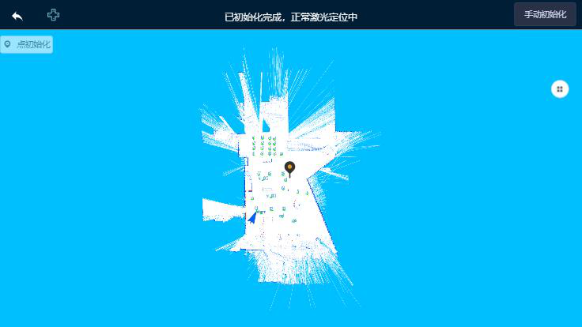{width="4.330555555555556in"
height="2.435937226596675in"}{width="4.1666666666666664e-2in"
height="4.1666666666666664e-2in"}{width="4.1666666666666664e-2in"
height="4.1666666666666664e-2in"}{width="4.1666666666666664e-2in"
height="4.1666666666666664e-2in"}{width="4.1666666666666664e-2in"
height="4.1666666666666664e-2in"}{width="4.1666666666666664e-2in"
height="4.1666666666666664e-2in"}{width="4.1666666666666664e-2in"
height="4.1666666666666664e-2in"}{width="4.1666666666666664e-2in"
height="4.1666666666666664e-2in"}{width="5.555555555555555e-2in"
height="4.1666666666666664e-2in"}

图3-1有三种位置初始化方式：

+-----------------+-----------------+-----------------+-----------------+
| ●               | >               | {width="0.1527 | 地图中已有录制  |
|                 |                 | 777777777778in" | 点的位置，调整  |
|                 |                 | h               | 机器人位置与该  |
|                 |                 | eight="0.166666 |                 |
|                 |                 | 66666666666in"} |                 |
+=================+=================+=================+=================+
+-----------------+-----------------+-----------------+-----------------+

录制点方向相同，点击【点初始化】按钮，然后在左侧列表选中该录制点名称，点击顶
部右侧【点初始化】即可定位，注意：所有的录制点和origin
点都可以作为初始点进行 定点初始化；\
●
手动初始化：顶部右侧点【手动初始化】，移动并旋转地图，将机器人移动到地图中机
器人现在实际位置，旋转地图到周围红色激光点与地图框架匹配，然后点击【完成】按
钮，直到看到激光与地图框架匹配上。

**3.2** 录点

> \(1\) 定位准确后，将机器人遥控至合适的位置和方位

+-----------------------+-----------------------+-----------------------+
| > \(2\) 在APP         | {width="0 | 标，选择【点管理】进  |
|                       | .21666557305336834in" | 入点管理主界面，点击  |
|                       | height="0             |                       |
|                       | .2055544619422572in"} |                       |
+=======================+=======================+=======================+
+-----------------------+-----------------------+-----------------------+

> 右上角【新建】弹出如图3-2
> 提示框，选择【录制点】，输入点名称后，并选择点类型；

14

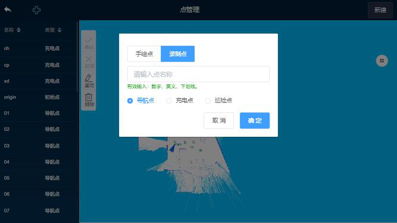{width="4.330554461942257in"
height="2.4347222222222222in"}

图3-2

> \(3\) 录点类型：
>
> ● 充电桩：用于给机器人充电（充电桩点必须通过录点方式录入）；
>
> ● 导航点：正常的导航点；
>
> ● 巡检点：正常的巡检点；
>
> \(4\) 点击【确定】，系统会将机器人当前的位置和方位记录为点位置信息；

**3.3** 手绘点

> 可直接在地图上可通行区域选择合适的点和点方位进行点录取，不需要遥控机器人到具

体的点。

1\. 在APP
首页，点击左下角的"{width="0.21666666666666667in"
height="0.20416666666666666in"}"图标，选择【点管理】进入点管理主界面，左边列表

> 显示已经添加在地图中的点列表，点击列表中的点名称，地图中该点将高亮显示。

2\. 点击新建按钮，弹出图3-3 提示框，输入合适的点名称和点类型并确认。

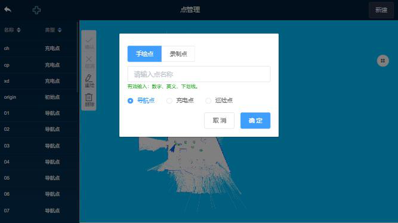{width="4.330554461942257in"
height="2.4347222222222222in"}

15

图3-3

3\.
拖动放缩地图让图钉处于需要录点的位置，点击【确认】按键确认点位置，再次拖动地
图，在刚刚确认的点上会有一个箭头用于显示该点的方位，拖动地图改变箭头方向，确
认方向后，再次点击【确认】，将该点保存在系统中，如图3-4。

> 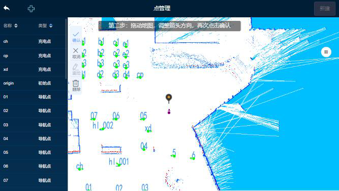{width="4.330554461942257in"
> height="2.436111111111111in"}

图3-4

**3.4** 手绘轨道

在户外或者开阔场地，跑点时为了让机器人在规定的轨道或者让机器人走在路中间或靠边行走，需要在执行跑点任务前，提前绘制合理的轨道，辅助导航跑点路径生成。在建图过程中，机器人会自动记录机器人的行走路径，并根据该路径生成轨道，若该轨道不满足要求，则需要通过手绘轨道重新绘制轨道，重新绘制的轨道保存成功后将自动显示原有轨道。

+-----------------------+-----------------------+-----------------------+
| 1\.                   | > 在APP               | > "图标               |
|                       | > 首页，点击左下角的  | ，选择【手绘轨道】，  |
|                       | "{width="0 |                       |
|                       | .21666666666666667in" |                       |
|                       | > height="0.          |                       |
|                       | 20555555555555555in"} |                       |
+=======================+=======================+=======================+
+-----------------------+-----------------------+-----------------------+

> 侧上方显示功能按键，选中手绘轨道，该地图的手绘轨道将在右侧地图中显示。

2\.
点击右上角【重建】，弹出提示框后，点击【确认】按钮，进入到手绘轨道界面。3.
可以通过地图录制点添加轨道。添加手绘轨道之前，首先需要按序在地图上添加相应的
录制点(如图3-5)

16

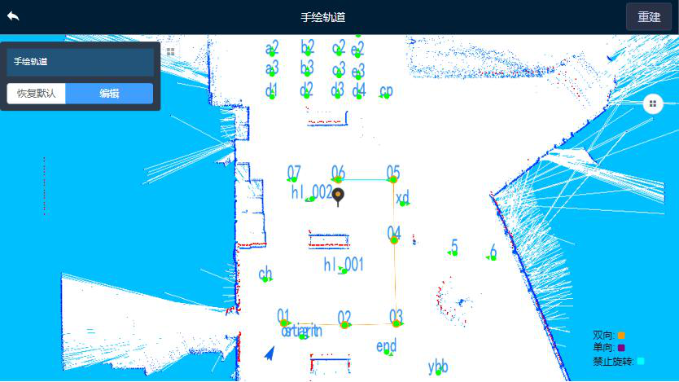{width="4.330554461942257in"
height="2.4347222222222222in"}

图3-5\
然后选择合适的录制点名称，点击【添加】即可。注：为解决在手绘轨道时，需要手绘多段重复轨道的问题，添加了【重置起点】功能，其作用是重置某个点的起始位置，会将重置的点作为起始点连接到另一个点，不需要在画重复的轨道来连接。

4\.
在手绘轨道界面中，点击点列表，每次选中一个导航点，就点击一次【添加点】，将所
有的导航点都连接起来。

5\.
绘制结束后，点击【保存】将绘制轨道保存，该轨道将自动覆盖系统中原有轨道。6.
地图中有直角拐角的地方，需要在拐角两端分别录制一个点，使其能够连接起来，例图
3-6 中，2 点-3 点，5 点-6
点，由于纯直线连接拐角处不利于阿克曼底盘行走，会影响到
机器人行驶的效果，我们需要在编辑轨道界面更改这段连接轨道的曲率，使其变得更加
圆滑适合于车子正常拐弯行走。

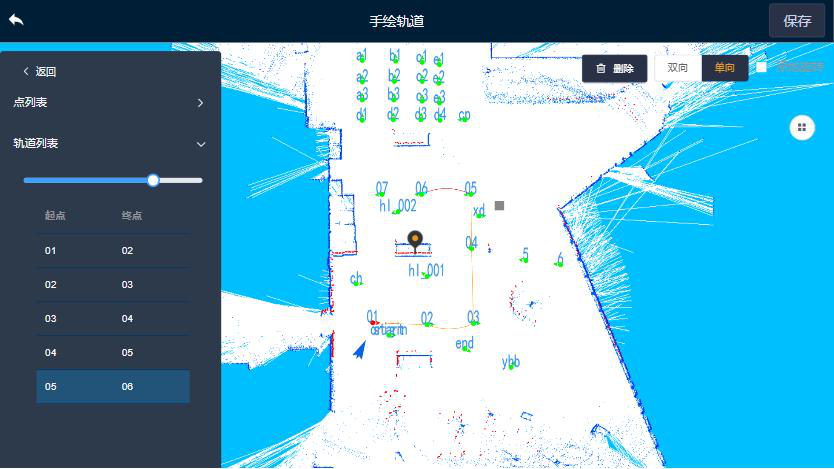{width="4.330554461942257in"
height="2.434721128608924in"}

图3-6\
编辑手绘轨道：主要是编辑线段的弯曲程度，设置轨道的单双性，增删轨道。

17

1\.
编辑轨道的弯曲度:在手绘轨道界面点击编辑，进入到编辑轨道界面，在左侧列表中选择
点击轨道列表，在轨道列表下方选择具体的线段名称，在右侧地图中会以红色显示选择
的线段，选择想要编辑的轨道线段，滑动滑块可以调节轨道线段的弯曲度大小，可以使
轨道变得更有弯曲度；\
2.
编辑轨道的单双性：在轨道列表界面，有单向和双向选择：选择单向，表示这段轨道只
能从起始点到达终点，例：只能从05 点到达06
点，如图3-7；选择双向，表示这段轨道
的两个点既是起始点也是终点，例：可以从01 点到达02 点，也可以从02
点达到01 点。

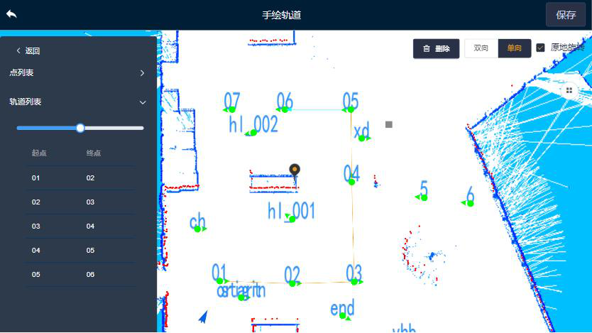{width="4.330554461942257in"
height="2.4347222222222222in"}

图3-7\
3.
增删部分轨道：在轨道编辑界面，点击点列表，在点列表下拉框中，选中一个点，点击
【重置起点】，可以重置某一个点作为起始点，再选择一个需要连接的点，点击【添加
点】，就可以添加一段轨道；在轨道编辑界面，点击轨道列表，在轨道列表下拉框中，
选择需要删除的一段轨道，点击【删除】，选中的轨道即可删除。

**3.5** 录路径

+-----------------+-----------------+-----------------+-----------------+
| 1\.             | > 在APP         | !               | "图标           |
|                 | > 首页          |  | 理】，进入【路  |
|                 |                 | {width="0.21666 | 径管理】功能界  |
|                 |                 | 557305336834in" |                 |
|                 |                 | height="0.20555 |                 |
|                 |                 | 44619422572in"} |                 |
+=================+=================+=================+=================+
+-----------------+-----------------+-----------------+-----------------+

> 面，点击右上角【新建】，在弹框中选择【录路径】并输入路径名称，点击【确定】按钮。

2\.
点击【开始】，遥控机器人在地图中行走，系统自动记录并优化机器人真实走过的路径。3.
点击【保存】按键，保存路径。

18

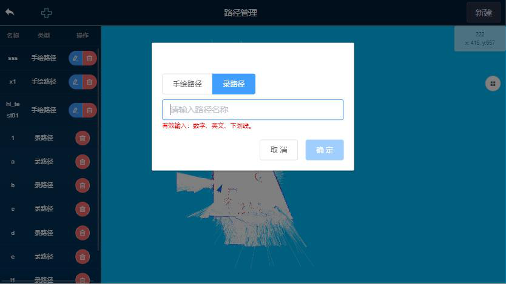{width="4.330554461942257in"
height="2.4347222222222222in"}

图3-8

**3.6** 手绘路径

> 在不需要遥控机器人的情况下，人工在地图中选择多个点，系统将自动将选择的多个点

用直线连接成一条路径；

+-----------------+-----------------+-----------------+-----------------+
| 1\.             | > 在APP         | !               | "图标           |
|                 | > 首页          |  | 理】，进入【路  |
|                 |                 | {width="0.21666 | 径管理】功能界  |
|                 |                 | 557305336834in" |                 |
|                 |                 | h               |                 |
|                 |                 | eight="0.205555 |                 |
|                 |                 | 55555555555in"} |                 |
+=================+=================+=================+=================+
+-----------------+-----------------+-----------------+-----------------+

> 面，左侧列表展示为已经建立的路径。

2\.
点击右上角【新建】按键，在弹框中选择【手绘路径】输入路径名称后并确认后，进入

> 路径绘制界面。

3\.
通过界面中的图钉，拖动地图选多个点，系统将两点之间用直线连接作为路径;

4\.
若两点之间的连线穿过了实体墙或者实体障碍物，会提示"路径不安全"，需重新选取;

5\. 绘制完成后通过地图右下方的【保存】按键保存，如图3-9。

6\. 左侧会显示绘制对应路径名称和控制路径弧度的拖动条。

7\.
在该界面中点击右侧"{width="0.18055555555555555in"
height="0.20277777777777778in"}"图标，分别勾选右侧的选项，可以显示和隐藏所有的点，路

> 径，虚拟墙，轨道等。

19

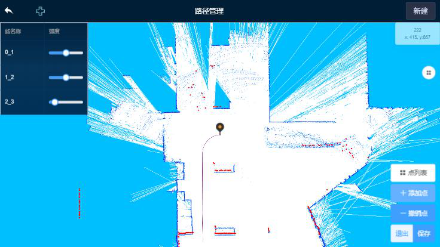{width="4.330554461942257in"
height="2.436111111111111in"}

图3-9

**3.7** 创建任务

若需要执行多个跑点连续运行或者多个路径连续运行，或者多次自动运行某些跑点或者路径任务，则需要首先建立相应的任务

+-----------------+-----------------+-----------------+-----------------+
| 1\.             | > 在APP         | !               | "图             |
|                 | > 首页          |  | 合任务】功能界  |
|                 |                 | {width="0.19166 | 面，点击右上角  |
|                 |                 | 666666666668in" |                 |
|                 |                 | h               |                 |
|                 |                 | eight="0.208333 |                 |
|                 |                 | 33333333334in"} |                 |
+=================+=================+=================+=================+
+-----------------+-----------------+-----------------+-----------------+

> 【新建】，输入任务名称，进入到新建任务界面，点击顶部下拉框，会在左侧列表显示出之前创建的所有点、路径、区域和停车位，勾选需要添加的点/路径/区域/停车位如图3-10

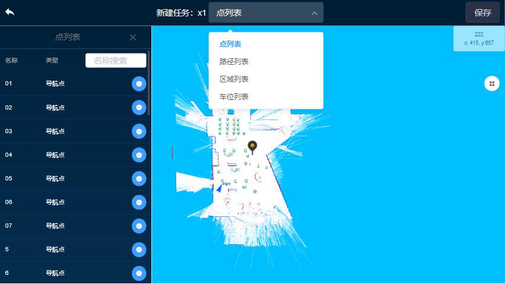{width="4.330554461942257in"
height="2.4347222222222222in"}

图3-10

  ------------------------------------------------------------------------------------------------------------------------------------------------------------
  点击列表右侧            {width="0.19583333333333333in"   （添加）按钮，会弹出弹窗（如图3-11）其中可以添加设置机器人跑点或路
                          height="0.18055555555555555in"}                                 
  ----------------------- --------------------------------------------------------------- --------------------------------------------------------------------

  ------------------------------------------------------------------------------------------------------------------------------------------------------------

径时的一些动作，设置动作及参数后，点击【添加动作】，所选动作和参数就会显示在下方

20

列表中，点击【确定】按钮，点/路径/区域/停车位以及相应的动作就添加完成，点击弹框右上角"x"关闭弹窗，可以查看已经选择的点/路径/区域/停车位，查看后点击【添加】又可以继续添加点/路径/区域/停车位，添加完成后，点击右上角【保存】按钮，一个任务就创建成功了。当点/路径/区域/停车位较多时，滑动列表区域，可显示隐藏的数据。

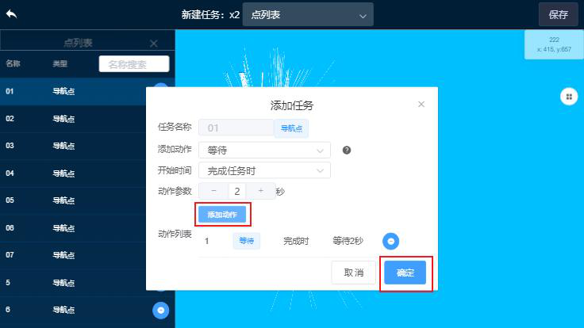{width="4.330554461942257in"
height="2.4361100174978128in"}

图3-11

**3.8** 跑任务

3.8.1 跑任务

1\. 在APP
首页，点击【开始任务】，进入组合任务界面。点击任务右上角【查看】，可查

> 看该任务中选择的点和路径，如图3-12。

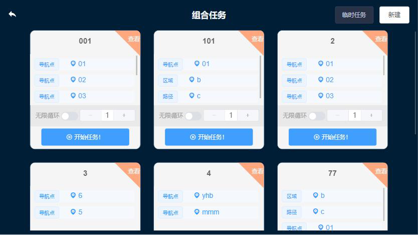{width="4.330554461942257in"
height="2.4347222222222222in"}

图3-12\
2.
如果点击了任务右上角【查看】，跳转至改任务的详情界面，点击【删除】可以删除该

> 任务，如图3-13。

21

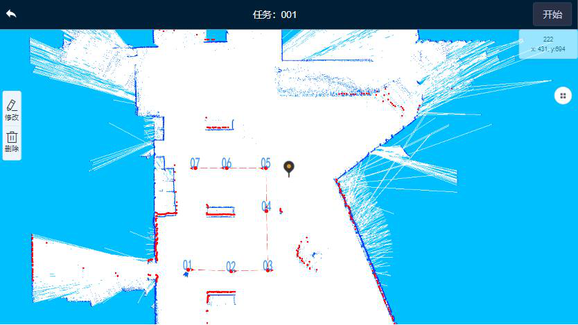{width="4.330554461942257in"
height="2.4347222222222222in"}

图3-13\
3.
【组合任务】功能界面中，点击"无限循环"滑动框，颜色变为绿色时，为无限循环状
态，机器人将会循环执行选中任务，或者点击滑动框旁边的加号按键，可执行任务任意
次数，默认为1 次，最大为50 次。

4\.
点击【开始任务！】，机器人将按照创建的组合任务依次完成既定的任务。当一次跑点
任务结束后，若剩余的循环跑点次数大于1，则机器人将再次自动进入该跑点任务状态并
执行，直至完成既定的循环次数。

5\.
任务执行过程中，可通过【结束】【暂停】【继续】按钮进行任务的结束、暂定和继续
操作，如图3-14。

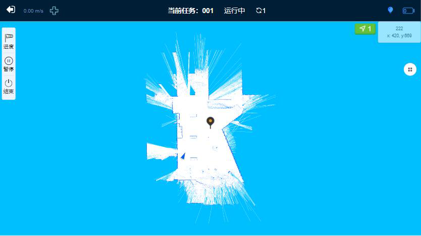{width="4.330554461942257in"
height="2.4347222222222222in"}

图3-14 3.8.2 跑路径\
让机器人沿着选定的路线行走。

> 在APP
> 首页，点击【开始任务】，进入组合任务界面。点击【临时任务】，在临时任务

22

界面中，通过顶部下拉框选择路经列表。如图3-15。

> 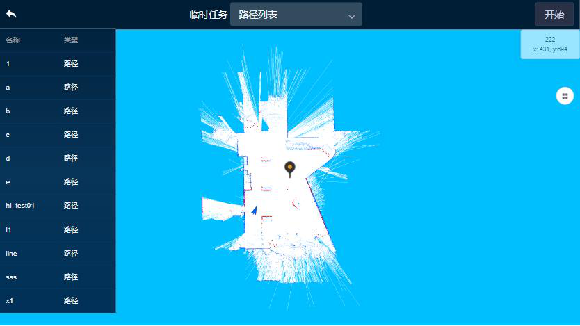{width="4.330555555555556in"
> height="2.4347222222222222in"}

图3-15\
1.
跑路径：在左侧列表选中具体的路径名称，点击右上方的【开始】按键，机器人将自动
规划路径运动到路径起点，然后沿着选择的路径行走到路径终点。

2\.
跑路径过程中可通过【暂停】、【继续】、【结束】按键对机器人运动状态进行控制。

3\. 删除路径：在APP
首页，点击左下角的"{width="0.21666666666666667in"
height="0.20416557305336833in"}"图标，点击【路径管理】，进入到路径管

> 理功能界面，在左侧列表中点击删除按键，即可将该路径从系统中删除。

3.8.3 跑点\
机器人正确定位后并且绘制轨道后，可以执行跑点任务。

在APP
首页，点击【开始任务】，进入组合任务界面。点击【临时任务】，在临时任务界面中，通过顶部下拉框选择点列表。

1\.
跑点：选中具体的点名称，点击右上方的【开始】按键，机器人将自动从当前位置运动
到选择点。

2\.
跑点过程中可通过【暂停】、【继续】、【结束】按键对机器人运动状态进行控制。

3\. 删除点：在APP
首页，点击左下角的"{width="0.21666557305336834in"
height="0.20416666666666666in"}"图标，点击【点管理】，进入【点管理】功

> 能界面，选择具体的点名称，点击【删除】按键，即可将该点从系统中删除。

**3.9** 定时任务

3.9.1 创建定时任务

> 在APP
> 首页，点击左下角的"{width="0.21666557305336834in"
> height="0.20416557305336833in"}

"图标，点击【定时任务】，进入【定时任务】功能界

> 23

面，可以查看已创建的定时任务列表，如图3-16

> 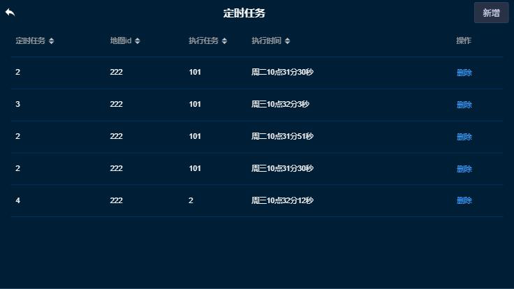{width="4.330555555555556in"
> height="2.4361100174978128in"}

图3-16\
点击右上角【新建】，进入【新增定时任务】功能界面，根据需要填写表单，如图3-17，点击【确定】就能保存一条新的定时任务。

> 是否循环：每周重复在指定的时间实行任务；\
> 打断任务：执行定时任务时，可自动停止正在手动执行的任务，直接进行定时任务。
>
> 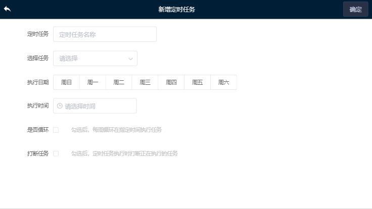{width="4.330555555555556in"
> height="2.436111111111111in"}

图3-17 3.9.2 删除定时任务

进入【定时任务】功能界面，可以查看已创建的定时任务列表，点击列表右侧【删除】按钮即可删除一条定时任务。

**3.10** 任务报告

+-----------------------+-----------------------+-----------------------+
| > 在APP               | {width="0 | 点击【任务报告】，进  |
|                       | .21666557305336834in" | 入【任务报告】功能界  |
|                       | height="0.            |                       |
|                       | 20416666666666666in"} |                       |
+=======================+=======================+=======================+
+-----------------------+-----------------------+-----------------------+

24

面，可以查看任务报告列表，如图3-18

> 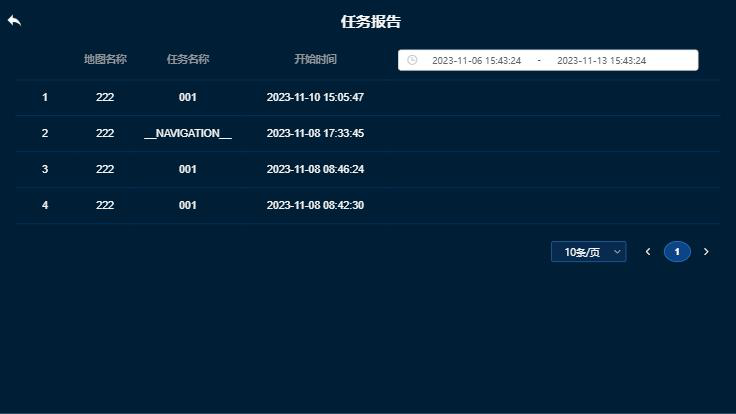{width="4.330555555555556in"
> height="2.4361100174978128in"}
>
> 图3-18点击表格行，跳转到查看任务报告详情，如图3-19
>
> 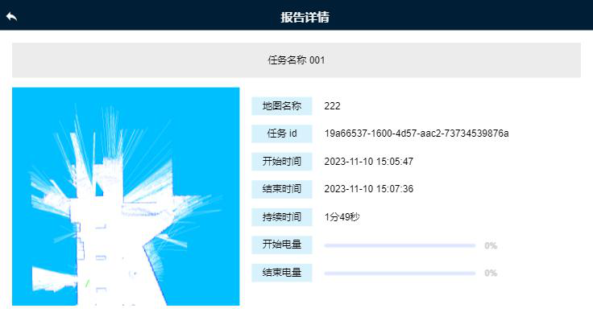{width="4.330555555555556in"
> height="2.4361100174978128in"}

图3-19

**4** 系统相关

**4.1** 参数配置

> 可在线设置机器人设定参数，在APP
> 首页，点击左下角的"{width="0.21666666666666667in"
> height="0.20555555555555555in"}"图标，点击【导航配

置】，进入导航配置功能界面，如图4-1。

25

> 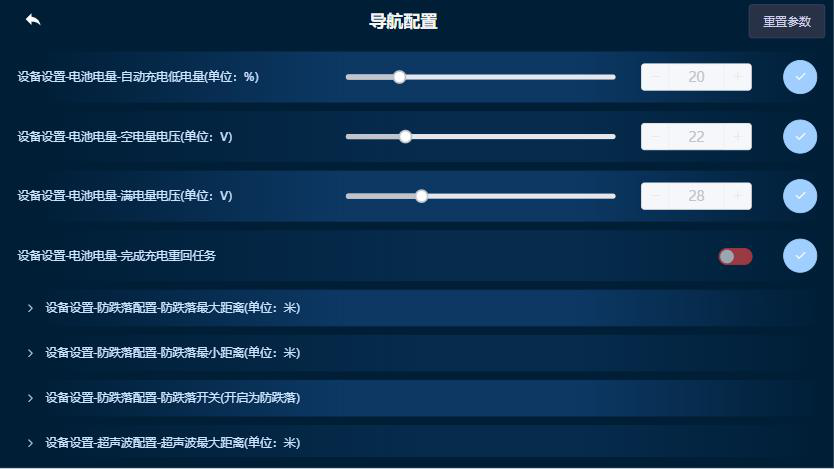{width="4.329166666666667in"
> height="2.4347222222222222in"}

图4-1\
1.
点击表格行，进入编辑状态，修改好参数后点击右侧"√"按钮，将修改参数上传保
存；\
2. 重置参数：将所有的参数值都重置到出厂设置；\
3. 有效与上下限制：bool 值变量，1 为有效，例如红外开关量设置为1
表示开启该红外设 备，0
为关闭。上下限主要设置参数的设置范围，现在主要用于导航和跟随的速度设置，
设置为0,1,2 分别表示低中高三中速度等级。

**4.2** 录包管理

> 在APP
> 首页，点击左下角的"{width="0.21666557305336834in"
> height="0.20416557305336833in"}"图标，点击【录包管理】，进入【录包管理】功能界

面，如图4-2，在此界面可查看已录制完成的包名信息，以及可以删除废弃的包。

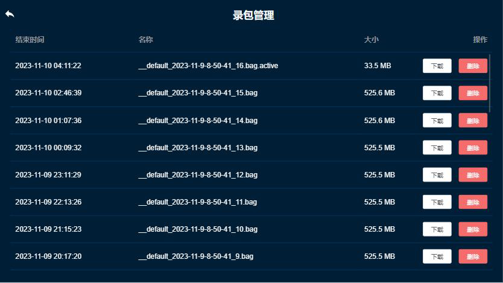{width="4.330554461942257in"
height="2.434721128608924in"}

图4-2

26

**4.3** 系统信息

> 在APP
> 首页，点击左下角的"{width="0.21666557305336834in"
> height="0.20555555555555555in"}"图标，点击【系统信息】，进入【系统信息】功能界

面，在此界面可查看APP 版本、固件版本，进行固件升级，Log
包下载，同步时间、查看系统状态、恢复出厂设置等功能。如图4-3\
1. 固件升级：在本栏可以查看APP
版本，固件版本信息，如果更新版本后无法显示出最新
信息，可以点击【刷新】按钮。在本栏可以为机器人进行固件升级。

2\. Log 包下载：当机器人发生问题时，可将log
包下载下来，供开发人员排查问题。3.
同步时间：将机器人时间与设备时间同步。

4\. 系统状态：查看CPU 温度、CPU 利用率、内存、磁盘信息\
5.
恢复出厂设置：点击恢复出厂设置后，将会把所有的数据清除，恢复至出厂状态，该功
能望谨慎使用。

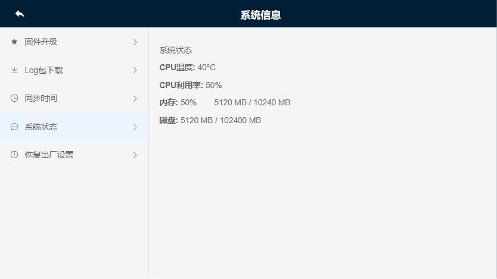{width="4.330554461942257in"
height="2.436111111111111in"}

图4-3

**5** 状态显示与控制

**5.1** 控制机器人移动

+-----------------------+-----------------------+-----------------------+
| > 在APP               | {width="0.1875in" |                       |
|                       | height="0.            |                       |
|                       | 18888888888888888in"} |                       |
+=======================+=======================+=======================+
+-----------------------+-----------------------+-----------------------+

移动的遥控窗口，通过点击方向按钮来控制机器人前后左右移动，中间按钮为急停按钮，可以控制机器人停止移动，每多点击一次方向按钮，都会使得机器人移动速度等级上升或者下

27

  -----------------------------------------------------------------------------------------------------------------------------------------------------
  降一个等级。想要关闭机器人移动窗口，可以再次点击界面上方的"   {width="0.18888888888888888in"   "图标，可以关闭该
                                                                height="0.1875in"}                                              
  ------------------------------------------------------------- --------------------------------------------------------------- -----------------------

  -----------------------------------------------------------------------------------------------------------------------------------------------------

遥控器。

{width="4.330554461942257in"
height="2.4347222222222222in"}

> 图5-1\
> 遥控速度：
>
> 在APP
> 首页（如图5-1），点击{width="0.21666666666666667in"
> height="0.20416557305336833in"}图标按钮，进入到【功能设置】界面，点击右上角

"{width="0.1569433508311461in"
height="0.1472211286089239in"}"图标，展开隐藏设置区，如图5-2

> {width="4.330555555555556in"
> height="2.4361100174978128in"}

图5-2\
遥控速度调整为高速，最大行驶速度能达到1.2
m/s，遥控速度调整为低速，最大行驶速度能达到0.6 m/s，默认为低速。

遥控类型：\
在隐藏设置区，遥控类型设置为摇杆，可将遥控器切换为摇杆类型，切换后遥控器如图5-3（默认遥控器为上下左右形式的箭头遥控器）。

28

> {width="4.330555555555556in"
> height="2.436111111111111in"}

图5-3

**5.2** 机器人信息显示

+-----------------------+-----------------------+-----------------------+
| > 在APP               | {width="0 | 机器人的移动速度，显  |
| -1），点击界面上方的" | .16944335083114612in" |                       |
|                       | height="0.            |                       |
|                       | 23888779527559056in"} |                       |
+=======================+=======================+=======================+
+-----------------------+-----------------------+-----------------------+

示转向角，电量等信息，如下图5-4：

{width="4.330554461942257in"
height="2.4347222222222222in"}

图5-4

● {width="0.6763888888888889in"
height="0.25in"}：当前机器人名称.

● {width="0.7402777777777778in"
height="0.1875in"}：当前机器人速度；

● {width="0.5513888888888889in"
height="0.18888888888888888in"}：当前机器人旋转角度。

● {width="0.3972211286089239in"
height="0.19722222222222222in"}：实时显示网络信号。

29

● {width="0.75in"
height="0.2805544619422572in"}：显示/隐藏云台控制遥控器

● {width="0.7083333333333334in"
height="0.28194444444444444in"}:查看机器人的底盘状态。

● {width="0.6986111111111111in"
height="0.2916666666666667in"}：录制包的图标，可进行录制地图，导航，定位包。

**5.3** 底盘状态

+-----------------------+-----------------------+-----------------------+
| > 在APP               | {width="0 | 中点击【底盘状态】按  |
| -1），点击界面上方的" | .16944335083114612in" |                       |
|                       | height="0.2375in"}    |                       |
+=======================+=======================+=======================+
+-----------------------+-----------------------+-----------------------+

钮，可以显示机器人的GPS、每个红外线状态和距离、超声波状态和距离、电压信息，如下

图5-5

> {width="4.330554461942257in"
> height="2.434721128608924in"}

图5-5

**5.4** 录包

+-----------------+-----------------+-----------------+-----------------+
| > 在APP         | "图标           | {width="0.6972 |                 |
| {width="0.1680 |                 | 66666666667in"} |                 |
| 544619422572in" |                 |                 |                 |
| >               |                 |                 |                 |
| height="0.23888 |                 |                 |                 |
| 88888888889in"} |                 |                 |                 |
+=================+=================+=================+=================+
+-----------------+-----------------+-----------------+-----------------+

如图5-6

30

> {width="4.330554461942257in"
> height="2.4347222222222222in"}

图5-6\
录包的功能在于发现问题后，可以将录制的包发送给工作人员，方便工作人员快速发现问题，录制包时，需要在点击【开始建图】之前，先对录包进行操作；当录制图标为红色时，表示正在录包；录包的类型主要有：

● 导航模式：地图和导航的包全部都进行录制。

● 建图/定位：当机器人发生定位不准确时，可进行录制。

**5.5** 云台控制

+-----------------------+-----------------------+-----------------------+
| > 在APP               | {width=" | 中点击【云台控制】按  |
| -1），点击界面上方的" | 0.1680544619422572in" |                       |
|                       | height="0.2375in"}    |                       |
+=======================+=======================+=======================+
+-----------------------+-----------------------+-----------------------+

钮，右下角会弹出一个云台控制遥控器，通过点击方向按钮来控制云台上下左右转动，中间

  -----------------------------------------------------------------------------------------------------------------------------------------------
  按钮为停止转动，右下角"   {width="0.13472222222222222in"   "为云台复位按钮。想要关闭云台控制窗口，可以再次点击
                            height="0.1875in"}                                              
  ------------------------- --------------------------------------------------------------- -----------------------------------------------------

  -----------------------------------------------------------------------------------------------------------------------------------------------

【云台控制】按钮，关闭该遥控器，如图5-7。

> {width="4.329166666666667in"
> height="2.4375in"}

31

图5-7

**5.6** 外接设备控制

> 喇叭、灯光、警灯控制：

在APP
首页（如图5-1），点击{width="0.21666666666666667in"
height="0.20555555555555555in"}图标按钮，进入到【功能设置】界面，点击右上角"{width="0.1569433508311461in"
height="0.1472211286089239in"}"图标，展开隐藏设置区，点击相应图标按钮，控制喇叭、灯光、警灯开关。如图5-2

**5.7** 音频收藏

+-----------------------+-----------------------+-----------------------+
| > 在APP               | {width="0 | 钮，选择【音频收藏】  |
| 首页（如图5-1），点击 | .21666557305336834in" | ，可以查看已上传的音  |
|                       | height="0.            |                       |
|                       | 20555555555555555in"} |                       |
+=======================+=======================+=======================+
+-----------------------+-----------------------+-----------------------+

频列表，点击【播放】可以播放该音频，同时能播放多个音频，点击右上角【停止】，可以停止所有播放声音。

上传音频：点击顶部右上角【上传】，选择移动设备文件夹中的.wav
格式音频，进行上传，上传成功后音频将保存在机器人系统中。

**6** 操作流程

1\. 首先通过平板或者手机连接机器人的WiFi。

2\.
打开机器人操作平台APP，配置机器人名称，IP，port，用户名，密码后点击登录。

  --------------------------------------------------------------------------------------------------------------------------------------------
  3\.                          {width="0.195832239720035in"   图标按钮，进入到【选择地图】功能界面，点击右上角
  登录完成后，进入首页，点击   height="0.2013888888888889in"}                               
  ---------------------------- ------------------------------------------------------------ --------------------------------------------------

  --------------------------------------------------------------------------------------------------------------------------------------------

> 【建图】，跳转到【创建地图】功能界面。

  ---------------------------------------------------------------------------------------------------------------------------------------------
  4\.                                 {width="0.18888888888888888in"   "图标，弹出遥控界面后，遥控器控制机器人
  点击【开始建图】，点击界面上方的"   height="0.18888779527559055in"}                                 
  ----------------------------------- --------------------------------------------------------------- -----------------------------------------

  ---------------------------------------------------------------------------------------------------------------------------------------------

> 移动，激光扫到的环境都会在右侧显示出来，建图完成后，点击【保存】，弹出提示框，为地图命名一个名字后，点击【确定】，一张地图就完成了。建图注意事项已在上方描述。

  ----------------------------------------------------------------------------------------------------------------------------------------------
  5\.                                            {width="0.19722222222222222in"   图标按钮，进入到【选择地图】就
  建图完成后，首先给地图添加虚拟墙：首页，点击   height="0.2013888888888889in"}                                 
  ---------------------------------------------- -------------------------------------------------------------- --------------------------------

  ----------------------------------------------------------------------------------------------------------------------------------------------

> 可以添加虚拟墙了。

6\.
位置初始化，帮助机器人在地图中正确定位，只有定位准确后才可正确导航；操作步骤：

> 在首页点击{width="0.2125in"
> height="0.23055555555555557in"}图标进入【位置初始化】主界面进行机器人位置初始化操作。

32

7\. 导航\
● 执行多个巡航点（推荐）\
1)录点：手绘点或者录制点功能添加需要的巡航点；\
2)绘制轨道：户外环境或者大场地需要通过轨道完成巡航任务；
3)创建多点导航任务；\
4)执行任务\
● 执行跟随路径\
1)录制路径：通过录制路径或者手绘路径完成；\
2)创建跟随路径任务\
3)执行任务

33

> 7 常见故障分析

+-----------------------+-----------------------+-----------------------+
| > 问题现象            | > 可能原因            | > 对策                |
+:======================+:======================+:======================+
| > 建图存在            | > 激光，控制          | > 激光水平放置并调整  |
| 重影或建图与实际不符  | 器放置位置角度不正确  | 角度朝向向前控制器水  |
|                       |                       | 平并调整角度朝向向前  |
+-----------------------+-----------------------+-----------------------+
|                       | > 建图路径没有回环    | > 严格                |
|                       |                       | 按照建图规则重新建图  |
+-----------------------+-----------------------+-----------------------+
| > 固件升级失败        | > 网络不稳定          | > 重启后重新升级      |
+-----------------------+-----------------------+-----------------------+
|                       | > 升级过              |                       |
|                       | 程中关闭软件或者机器  |                       |
+-----------------------+-----------------------+-----------------------+
| > 行驶过              | > 机器人供电不足      | > 请及时充电          |
| 程中突然停止不在运行  |                       |                       |
+-----------------------+-----------------------+-----------------------+
|                       | > 电机掉线            | > 重                  |
|                       |                       | 新检查电机线路和电机  |
|                       |                       | 状态，确保正常后重启  |
+-----------------------+-----------------------+-----------------------+
|                       | > 激光掉线            | > 检查并牢固安装激光  |
|                       |                       | 线路，确保正常后重启  |
+-----------------------+-----------------------+-----------------------+
| > 行驶过程中卡顿倒退  | > 激光前有障碍物      | > 检查超              |
|                       |                       | 声波是否有障碍并清除  |
+-----------------------+-----------------------+-----------------------+
|                       | > 超声波干扰          | > 检查超声波工作      |
|                       |                       | 状态，并适当调整超声  |
|                       |                       | 波测距参数，推荐20-4  |
|                       |                       | 0CM；开启与关闭适当数 |
|                       |                       | 量的超声波；两个超声  |
|                       |                       | 波之间的距离不能太近  |
+-----------------------+-----------------------+-----------------------+
|                       | > 红外干扰            | > 检查红外工作状态，  |
|                       |                       | 检测红外设备是否水平  |
|                       |                       | 放置，是否检测到地面  |
+-----------------------+-----------------------+-----------------------+
| > 行驶蔽              | > 当前道路路径拥堵    | > 查看当前行走路径是  |
| 障过程中突然掉头蔽障  |                       | 否堵住或预留空间较小  |
+-----------------------+-----------------------+-----------------------+
| > 行驶过              | > 激光放置方位有偏移  | > 重新正              |
| 程中机器左右摆动较大  |                       | 确安装激光位置和方位  |
+-----------------------+-----------------------+-----------------------+
|                       | >                     | > 新建地图            |
|                       |  新环境变化较大，与正 |                       |
|                       | 在执行的地图偏差较大  |                       |
+-----------------------+-----------------------+-----------------------+
|                       | > 建立地图重影        | > 严格                |
|                       |                       | 按照建图规则重新建图  |
+-----------------------+-----------------------+-----------------------+

34
