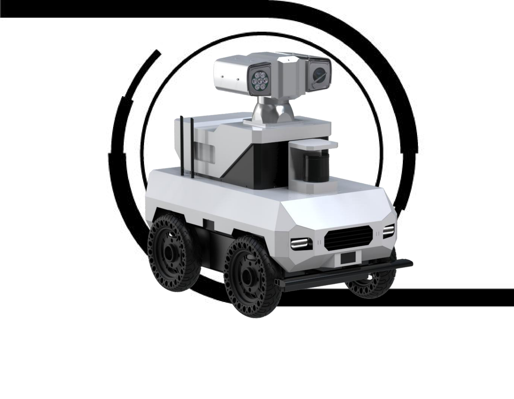
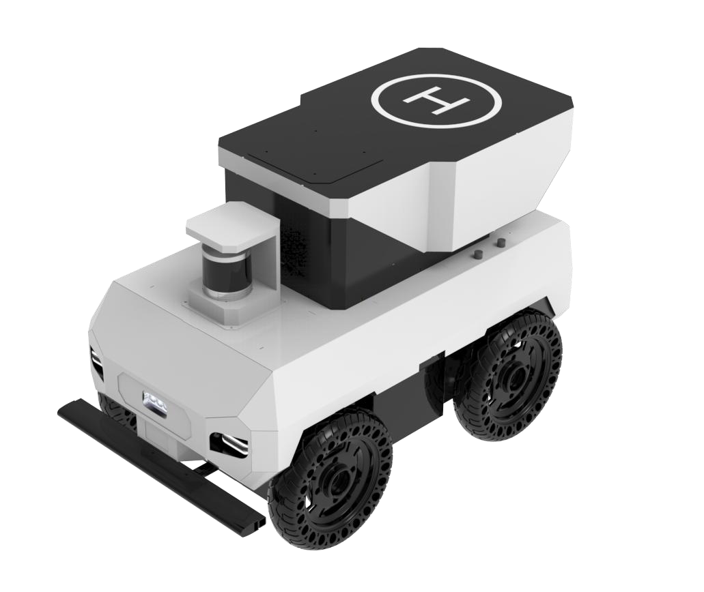
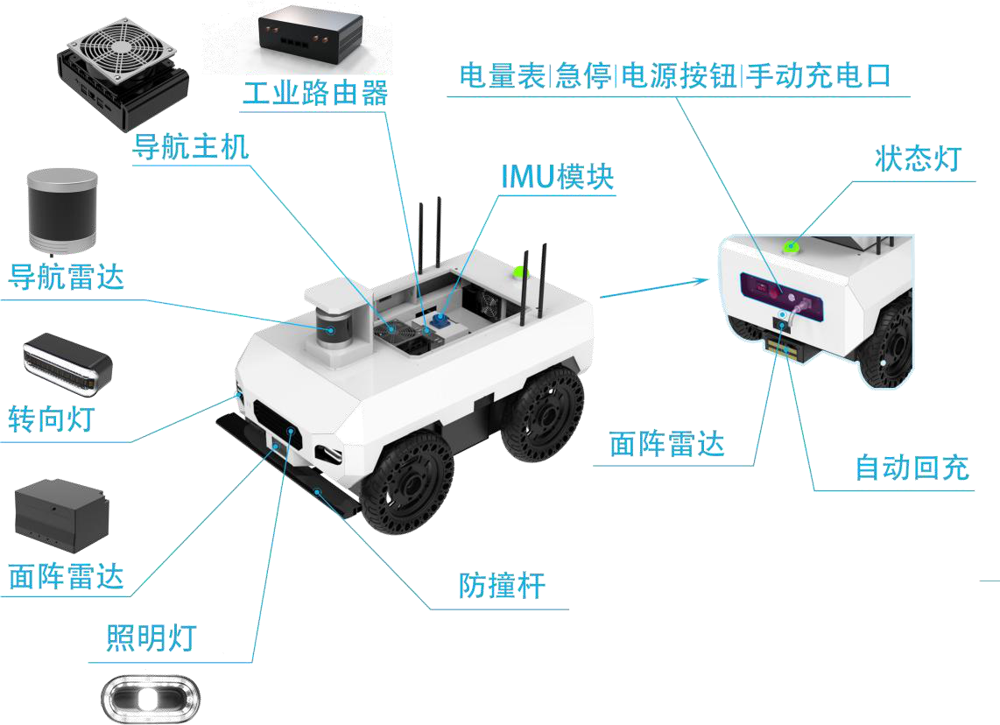
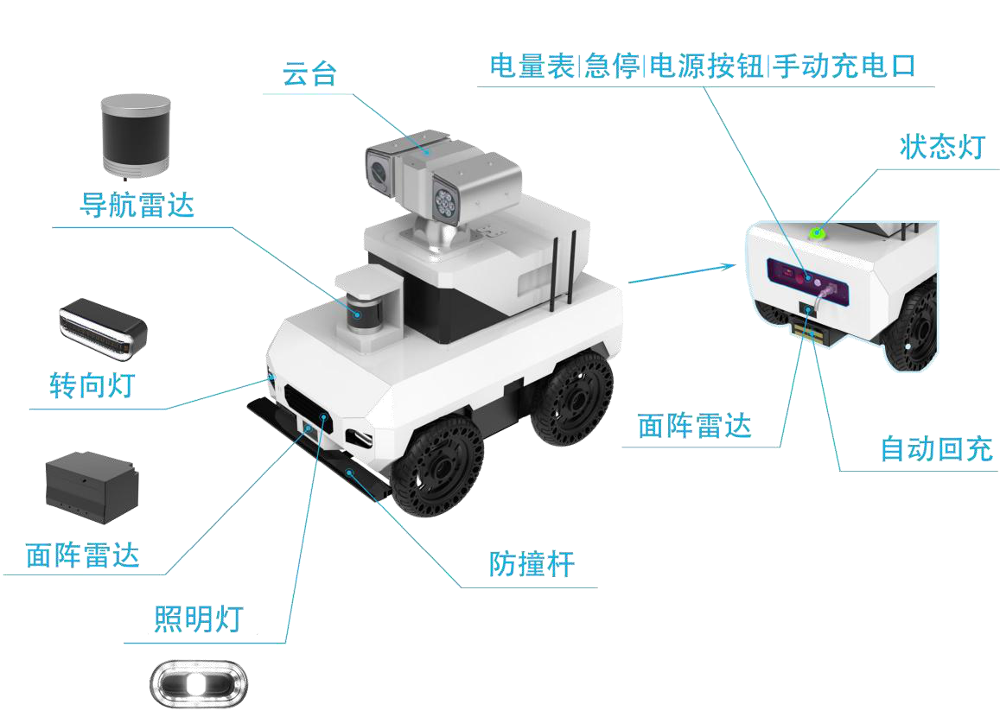
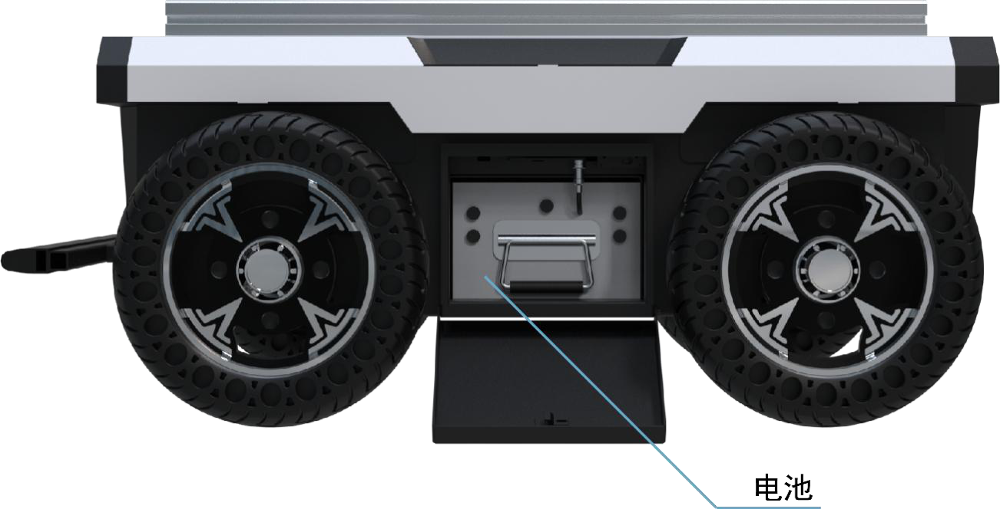
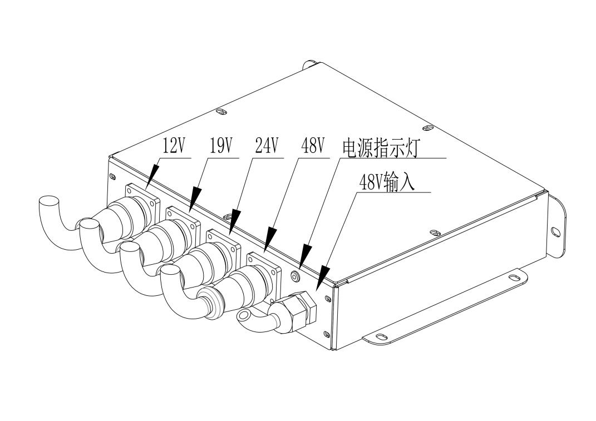

{width="8.465277777777779in"
height="6.577389545056868in"}

产品使用手册

PRODUCT

> MANUAL
>
> 注意说明：本章说明包含了SeaRobot 01
> 系列产品相关的重要安全信息，在本机第一次上电开
>
> 机测试之前，希望各位用户可以详细阅读相关的说明信息，了解有关底盘的使用说明。针对带
>
> 警告符号的相关标志应特别注意。
>
> ·首次使用，请先仔细阅读本手册，了解基本操作内容与操作规范。·遥控操作，请在视距范围内使用，狭窄区域中操作注意安全。
>
> ·在-10℃\~40℃的环境温度中使用。
>
> ·使⽤设备操作前，注意现场情况，避免误操作导致⼈员安全问题发⽣。
>
> ·遇到紧急情况，请按下急停按钮，严重故障时断电关闭设备。·当设备出现异常时，请立即停止使用，避免造成二次伤害。·当设备出现异常时，请联系相关技术人员，请勿擅自处理。
>
> ·请勿未经技术⽀持和允许，私⾃改装内部线路以及内部结构。
>
> SeaRobot 01 系列------四轮差速运动底盘
>
> SeaRobot 01 用户使用手册

+-----------------------+-----------------------+-----------------------+
| > 版本                | > 修订日期            | > 修订内容            |
+:======================+:======================+:======================+
| > V1.0                | > 2024.2.25           | > 第一版              |
+-----------------------+-----------------------+-----------------------+
|                       |                       |                       |
+-----------------------+-----------------------+-----------------------+

> 目 录

**1 SeaRobot 01**
系列底盘简介**\...\...\...\...\...\...\...\...\...\...\...\...\...\...\...\...\...\...\...\...\...\...\...\...\...\...\...\...\....
1** 1.1
产品简介\...\...\...\...\...\...\...\...\...\...\...\...\...\...\...\...\...\...\...\...\...\....
1 1.2
产品优势和特点\...\...\...\...\...\...\...\...\...\...\...\...\...\...\...\...\...\...\...\....
2 1.3
产品配件列表\...\...\...\...\...\...\...\...\...\...\...\...\...\...\...\...\...\...\...\...\...
3

**2**
车体部件介绍**\...\...\...\...\...\...\...\...\...\...\...\...\...\...\...\...\...\...\...\...\...\...\...\...\...\...\...\...\...\...\...\...\...\...\...\...\.....4**
2.1
部件标注（部分配件仅供参考）\...\...\...\...\...\...\...\...\...\...\...\...\...\...\...\...4
2.3
电池仓\...\...\...\...\...\...\...\...\...\...\...\...\...\...\...\...\...\...\...\...\...\...\....5
2.4
电源盒\...\...\...\...\...\...\...\...\...\...\...\...\...\...\...\...\...\...\...\...\...\...\....6

**3 SeaRobot 01**
底盘操作说明**\...\...\...\...\...\...\...\...\...\...\...\...\...\...\...\...\...\...\...\...\...\...\...\...\...\...\...\...\....
8** 3.1
遥控操作示说明\...\...\...\...\...\...\...\...\...\...\...\...\...\...\...\...\...\...\...\.....8
3.2
底盘控制基本操作流程\...\...\...\...\...\...\...\...\...\...\...\...\...\...\...\...\...\....
9

**4**、通讯协议（串口）**\...\...\...\...\...\...\...\...\...\...\...\...\...\...\...\...\...\...\...\...\...\...\...\...\...\...\...\...\...\...\...\...\....11**
4.1
通讯参数\...\...\...\...\...\...\...\...\...\...\...\...\...\...\...\...\...\...\...\...\...\...
11 4.2
上位机下发指令\...\...\...\...\...\...\...\...\...\...\...\...\...\...\...\...\...\...\...\...
11 4.3
底盘数据上传\...\...\...\...\...\...\...\...\...\...\...\...\...\...\...\...\...\...\...\.....
17

**5**
注意事项**\...\...\...\...\...\...\...\...\...\...\...\...\...\...\...\...\...\...\...\...\...\...\...\...\...\...\...\...\...\...\...\...\...\...\...\...\...\...\.....24**
5.1
使用环境注意事项\...\...\...\...\...\...\...\...\...\...\...\...\...\...\...\...\...\...\....
24 5.2
机械负载注意事项\...\...\...\...\...\...\...\...\...\...\...\...\...\...\...\...\...\...\....
24 5.3
电气外部扩展注意事项\...\...\...\...\...\...\...\...\...\...\...\...\...\...\...\...\...\...
24 5.4
其他注意事项\...\...\...\...\...\...\...\...\...\...\...\...\...\...\...\...\...\...\...\.....
24

**6**
底盘质保等常见问题**\...\...\...\...\...\...\...\...\...\...\...\...\...\...\...\...\...\...\...\...\...\...\...\...\...\...\...\...\...\...\...\.....25**

1 SeaRobot 01 系列底盘简介

1.1 产品简介

> SeaRobot 01
> 系列无人车是一款基于室内外全地形的自主移动机器人底盘，其主要针

对室外越野、农业、园区等场景。SeaRobot 01
系列无人车适配四套直流无刷伺服电机，四个

轮子均可以独立控制速度。整车VCU 基于ARM
的控制板，不但可以控制车辆运动行驶，还能直

接反馈各个轮子速度，电量电压和相关的车辆状态。SeaRobot 01
系列无人车支持巡航点设置

和绘制功能、轨迹点设置功能和轨迹录制功能、地图构建与地图切换、激光自动回充功能以及

后台管理等。

{width="5.0777777777777775in"
height="4.275in"}

1

1.2 产品优势和特点

1.2.1 多地形适应，无惧复杂环境

SeaRobot 01
系列底盘载四套独立控制直流无刷伺服电机，四轮独立驱动，精准分配动力，兼顾稳定性与通过性，适应室内外多场景切换需求。

1.2.2 强劲动力与精准控制

通过先进的运动控制算法，SeaRobot 01 系列，以ARM 架构整车VCU
控制系统，实时监控车辆状态（轮速、电量、电压等），动态调节动力输出，确保运行稳定性。支持差速转向、原地旋转等灵活运动模式。

1.2.3 智能导航与自主作业

> SeaRobot 01 多模态导航功能\
> •激光SLAM 建图：快速构建厘米级精度2D
> 地图，支持增量更新，动态适应环境变化。•巡航点设置、轨迹录制、轨道点规划：一键部署巡检路线，支持循环任务与路径记忆。激光末端定位+自动回充：任务完成后自动返回充电桩，实现7×24
> 小时无人值守作业。

1.2.4 超长续航与大载重设计

•80KG
超大载重，可搭载机械臂、传感器、货箱等多种设备，满足农业运输、物资配送等需求。

•3
小时长续航+电池快拆设计，电池快速更换，使作业无缝衔接；多路电压输出（48V/24V/19V/12V），直接为外设供电，减少额外电源配置。

1.2.5 高度灵活，支持深度定制

提供软硬件开放接口，可适配用户定制化功能模块（如喷洒系统、监测设备等）。底盘结构支持扩展改造，满足不同场景的机械安装与功能集成需求。

2

1.3 产品配件列表

+-----------------+-----------------+-----------------+-----------------+
| 底盘配件清单    |                 |                 |                 |
+:================+:===============:+:===============:+:===============:+
| > SeaRobot 01   | 1 套            |                 |                 |
| > 机器人本体    |                 |                 |                 |
+-----------------+-----------------+-----------------+-----------------+
| > 锂电池充      | 1 套            |                 |                 |
| 电器（AC220V）  |                 |                 |                 |
+-----------------+-----------------+-----------------+-----------------+
| > 对外供电模块  | 1 套            |                 |                 |
+-----------------+-----------------+-----------------+-----------------+
| > 2.4G          | 1 套            |                 |                 |
| > 航模遥控器    |                 |                 |                 |
+-----------------+-----------------+-----------------+-----------------+
| > 供电插头      | 1 套            |                 |                 |
+-----------------+-----------------+-----------------+-----------------+
| 激光导航清单    |                 |                 |                 |
+-----------------+-----------------+-----------------+-----------------+
| 激光导航主机    | 1 套            | 自动回充模块    | 1 套            |
+-----------------+-----------------+-----------------+-----------------+
| 16 线激光雷达   | 1 套            | 工业路由器      | 1 套            |
+-----------------+-----------------+-----------------+-----------------+

3

2 车体部件介绍

2.1 部件标注（部分配件仅供参考）

> {width="4.752777777777778in"
> height="3.4458333333333333in"}
>
> {width="4.904166666666667in"
> height="3.5180555555555557in"}

4

2.2 电池仓

{width="5.919444444444444in"
height="3.0166666666666666in"}

> 底盘电池支持快拆，按下电池仓盖板即可打开盖板，电池接口定义如下
>
> 电池放电口：XT90 母头\
> 电池充电口：XT60 母头\
> **BMS** 接口：USB
>
> 更换电池后需重新接好三个插头，否则影响正常功能使用。

5

2.3 电源盒

> {width="4.870833333333334in"
> height="3.441666666666667in"}

**48V** 输入

带线引出，接头为XT60 公头，接入电源通讯面板中的电源输出口。

**48V** 接口定义

+-----------------------+-----------------------+-----------------------+
| 插头型号              | 引脚编号              | 引脚定义              |
+:=====================:+:=====================:+:=====================:+
| 威浦WS20-6P           | 1                     | 正                    |
+-----------------------+-----------------------+-----------------------+
| 输出参数              | 2                     | 正                    |
+-----------------------+-----------------------+-----------------------+
| > 电池输出\           | 3                     | 负                    |
| > 45 -- 54.6V         |                       |                       |
+-----------------------+-----------------------+-----------------------+
|                       | 4                     | 负                    |
+-----------------------+-----------------------+-----------------------+
|                       | 5                     | NC                    |
+-----------------------+-----------------------+-----------------------+
|                       | 6                     | NC                    |
+-----------------------+-----------------------+-----------------------+

6

**24V** 接口定义

  -----------------------------------------------------------------------
         插头型号                引脚编号                引脚定义
  ----------------------- ----------------------- -----------------------
        威浦WS20-5P                  1                      正

         输出参数                    2                      正

          24V 10A                    3                      负

                                     4                      负

                                     5                      NC
  -----------------------------------------------------------------------

**19V** 接口定义

  -----------------------------------------------------------------------
         插头型号                引脚编号                引脚定义
  ----------------------- ----------------------- -----------------------
        威浦WS20-4P                  1                      正

         输出参数                    2                      正

          19V 10A                    3                      负

                                     4                      负
  -----------------------------------------------------------------------

**12V** 接口定义

  -----------------------------------------------------------------------
         插头型号                引脚编号                引脚定义
  ----------------------- ----------------------- -----------------------
        威浦WS20-3P                  1                      正

         输出参数                    2                      负

          12V 15A                    3                      NC
  -----------------------------------------------------------------------

7

3 SeaRobot 01 底盘操作说明

3.1 遥控操作示说明

{width="6.768054461942257in"
height="3.348610017497813in"}

遥控器介绍

电源开关：同时按下左右两边电源开关开启/关闭遥控器\
SWA：速度档位切换开关，拨到上方为全速模式，下方为半速模式。

SWB：模式切换开关，拨到下方为遥控模式，中间为CAN/串口（RS232）控制模式，上方为触发自动回充。

SWD：遥控急停开关，拨到上方为触发急停，下方为解除急停。（当遥控开启时，若拨到上方，遥控和CAN均不可控制底盘）。

左摇杆：前/后拨动控制底盘前进/后退。

右摇杆：左/右拨动控制底盘左/右转向。

SWC、VRA、VRB暂未使用。

遥控背后左右两侧按键无功能。

8

3.2 底盘控制基本操作流程

**3.2.1** 启动

1、按下开关面板电源按钮，蜂鸣器响一声即开机完成，若蜂鸣器一直鸣响，即为车辆故障，应停止使用。

2、检查电压表显示电压，若电压低于45V，应停止使用并按充电流程给底盘充电。

**3.2.2** 遥控

1、开启底盘电源，解除底盘急停。

2、开启遥控器电源开关，等待触摸屏亮起。开机前SWA，SWB，SWC，SWD
需要全部拨到最上方，若不在最上方触摸屏会有提示，此时全部拨到最上方即可。

3、把SWB 拨到下方（遥控模式），把SWD 拨到下方（解除遥控急停）。

4、操作左摇杆前/后控制底盘前进和后退，操作右摇杆左/右控制底盘左/右转向，SWA
切换高速/低速档。

**3.2.3** 急停

按下底盘尾部红色急停按钮或者把遥控SWD 开关拨到上方。

**3.2.4** 关闭电源

按下开关面板电源按钮即可，非紧急情况请勿在底盘行走时关闭电源。

**3.2.5** 防撞条

当在运动中撞击到物体，底盘会紧急停车，上位机通讯和遥控器均不能操作，解除碰撞状态方法如下：\
1、按下底盘急停按键后再解除急停。

2、使用遥控器SWD 开关急停后再解除急停。\
3、使用上位机通讯下发解除指令。

9

**3.2.6** 充电

底盘采用48V 电池，电压范围45 - 54.6V，当电压低于45V
时应停止使用并充电。充电具体流程如下：\
1、关闭底盘电源。

2、先将充电器插入底盘充电接口中，然后将充电器连接到220V 插座上。

3、充电过程中充电器指示灯为红色，充电完成后指示灯转为绿色。4、若需要中途停止充电，需要先断开220V
电源，再从底盘拔除充电器。

**3.2.7** 自动回充

当底盘电压较低，但当前电量尚且足够底盘能正常动作时（建议电压大于46V），若底盘装有自动回充模块，也可使用自动回充模块对底盘进行充电，具体流程如下：\
上位机控制底盘前往充电\
1、按照正常操作流程启动底盘。

2、使用遥控控制底盘前往回充桩正前方大约1
米处停下，然后关闭遥控器。3、上位机发送启动回充命令。

4、底盘自动前往回充桩进行充电。

5、若需要退出回充模式，上位机发送停止回充命令即可。

遥控控制底盘前往充电\
1、按照正常操作流程启动底盘。

2、使用遥控控制底盘前往回充桩正前方大约1 米处停下。

3、遥控开关SWB 切换到最上的自动回充模式。

4、底盘自动前往回充桩进行充电（此时可以关闭遥控器）。

5、若需要退出回充模式，把遥控开关SWB 拨回最下遥控模式即可。

**3.2.8** 灯光

1、底盘故障：所有灯均为红色常亮\
2、遥控急停，软件急停，急停按键按下，防撞杆触发：状态灯红色常亮3、正常状态：状态灯为绿色常亮，转向灯随转向方向闪烁

10

> 4、通讯协议（串口）
>
> 协议版本：1.0.3.241127
>
> 4.1 通讯参数
>
> 波特率：115200
>
> 数据位：8
>
> 校验位：None
>
> 停止位：1
>
> 4.2 上位机下发指令
>
> 当遥控器未开启时，可直接由上位机通讯控制。
>
> 在遥控器模式下需要将SWB 开关拨到中间档位。
>
> 4.2.1 20ms 底盘数据上传(ID=0x01)

+-----------------------+-----------------------+-----------------------+
| 内容                  | 字节长度              | 备注                  |
+:=====================:+:=====================:+:=====================:+
| FRAME-HEAD            | 2(uint16)             | 帧头（0xDEED）        |
+-----------------------+-----------------------+-----------------------+
| FRAME-NUMS            | 2(uint16)             | 帧序号（递增，可      |
|                       |                       | 用来记录发送的次数）  |
+-----------------------+-----------------------+-----------------------+
| FRAME-ID              | 1(uint8)              | 帧ID（0x01）          |
+-----------------------+-----------------------+-----------------------+
| FRAME-LEN             | 1(uint8)              | 帧长度（0x0C）        |
+-----------------------+-----------------------+-----------------------+
| Data                  | 2(uint16)             | > 0：关闭20ms         |
|                       |                       | > 数据上传\           |
|                       |                       | > 1：开启20ms         |
|                       |                       | > 数据反馈            |
+-----------------------+-----------------------+-----------------------+
| Check                 | 2(uint16)             | 校验（从FRAME-HEAD    |
|                       |                       | 到Data 的和）         |
+-----------------------+-----------------------+-----------------------+
| FRAME-END             | 2(uint16)             | 帧尾(0xBCBD)          |
+-----------------------+-----------------------+-----------------------+
| 示例                  | > ED DE 01 00 01 0C   |                       |
|                       | > 00 00 D9 01 BD      |                       |
|                       | > BC(关闭20ms         |                       |
|                       | > 数据上传) ED DE 01  |                       |
|                       | > 00 01 0C 01 00 DA   |                       |
|                       | > 01 BD BC(开启20ms   |                       |
|                       | > 数据反馈)           |                       |
|                       | > (命令返回0x81)      |                       |
+-----------------------+-----------------------+-----------------------+

11

> 4.2.2 底盘数据指令控制、线速模式(ID=0x02)

  --------------------------------------------------------------------------------------
           内容                  字节长度                          备注
  ----------------------- ----------------------- --------------------------------------
         FRAME-EAD               2(uint16)                    帧头（0xDEED）

         FRAME-UMS               2(uint16)         帧序号（递增，可用来记录发送的次数）

         FRAME-ID                1(uint8)                      帧ID（0x02）

         FRAME-LEN               1(uint8)                     帧长度（0x12）

           Data0                 2(uint16)                  0x0000（线速模式）

           Data1                 2(int16)                Vx (x 轴速度) 单位：mm/s

           Data2                 4(float)               Vz (z 轴速度) 单位：rad/s

           Data3                                  

           Check                 2(uint16)           校验（从FRAME-HEAD 到Data 的和）

         FRAME-END               2(uint16)                     帧尾(0xBCBD)

           示例           ED DE 00 00 02 12 00 00 
                          C8 00 00 00 00 00 A7 02 
                           BD BC（Vx=200,Vz=0）   
  --------------------------------------------------------------------------------------

> **4.2.3** 底盘数据指令控制、轮速度模式**(ID=0x02)**

  --------------------------------------------------------------------------------------------
           内容                  字节长度                             备注
  ----------------------- ----------------------- --------------------------------------------
        FRAME-HEAD               2(uint16)                       帧头（0xDEED）

        FRAME-NUMS               2(uint16)            帧序号（递增，可用来记录发送的次数）

         FRAME-ID                1(uint8)                         帧ID（0x02）

         FRAME-LEN               1(uint8)                        帧长度（0x12）

           Data0                 2(uint16)                     0x0001（轮速模式）

           Data1                 2(int16)          左侧速度单位：mm/s(前左轮和后左轮速度一致)

           Data2                 2(int16)          右侧速度单位：mm/s(前右轮和后右轮速度一致)

           Data3                 2(uint16)                            保留

           Check                 2(uint16)              校验（从FRAME-HEAD 到Data 的和）

         FRAME-END               2(uint16)                        帧尾(0xBCBD)

           示例           ED DE 00 00 02 12 01 00 
                          C8 00 C1 00 00 00 69 03 
                                    BD            
                           BC（Lsp=200,Rsp=193）  
  --------------------------------------------------------------------------------------------

12

> **4.2.4** 急停设置**(ID=0x03)**

+-----------------------+-----------------------+-----------------------+
| 内容                  | 字节长度              | 备注                  |
+:=====================:+:=====================:+:=====================:+
| FRAME-HEAD            | 2(uint16)             | 帧头（0xDEED）        |
+-----------------------+-----------------------+-----------------------+
| FRAME-NUMS            | 2(uint16)             | 帧序号（递增，可      |
|                       |                       | 用来记录发送的次数）  |
+-----------------------+-----------------------+-----------------------+
| FRAME-ID              | 1(uint8)              | 帧ID（0x03）          |
+-----------------------+-----------------------+-----------------------+
| FRAME-LEN             | 1(uint8)              | 帧长度（0x0C）        |
+-----------------------+-----------------------+-----------------------+
| Data                  | 2(uint16)             | > 0：取消急停\        |
|                       |                       | > 1：急停             |
+-----------------------+-----------------------+-----------------------+
| Check                 | 2(uint16)             | 校验（从FRAME-HEAD    |
|                       |                       | 到Data 的和）         |
+-----------------------+-----------------------+-----------------------+
| FRAME-END             | 2(uint16)             | 帧尾(0xBCBD)          |
+-----------------------+-----------------------+-----------------------+
| 示例                  | > ED DE 00 00 03 0C   |                       |
|                       | > 00 00 DA 01 BD      |                       |
|                       | > BC（取消急停）ED DE |                       |
|                       | > 00 00 03 0C 01 00   |                       |
|                       | > DB 01 BD BC（急停） |                       |
+-----------------------+-----------------------+-----------------------+

> **4.2.5** 清除故障**(ID=0x05)**

+-----------------------+-----------------------+-----------------------+
| 内容                  | 字节长度              | 备注                  |
+:=====================:+:=====================:+:=====================:+
| FRAME-HEAD            | 2(uint16)             | 帧头（0xDEED）        |
+-----------------------+-----------------------+-----------------------+
| FRAME-NUMS            | 2(uint16)             | 帧序号（递增，可      |
|                       |                       | 用来记录发送的次数）  |
+-----------------------+-----------------------+-----------------------+
| FRAME-ID              | 1(uint8)              | 帧ID（0x05）          |
+-----------------------+-----------------------+-----------------------+
| FRAME-LEN             | 1(uint8)              | 帧长度（0x0C）        |
+-----------------------+-----------------------+-----------------------+
| Data                  | 2(uint16)             | > Bit0:清除驱         |
|                       |                       | 动器故障（1：生效）Bi |
|                       |                       | t1:清除前防撞杆故障（ |
|                       |                       | 1：生效）Bit2:清除防  |
|                       |                       | 后撞杆故障（1：生效） |
+-----------------------+-----------------------+-----------------------+
| Check                 | 2(uint16)             | 校验（从FRAME-HEAD    |
|                       |                       | 到Data 的和）         |
+-----------------------+-----------------------+-----------------------+
| FRAME-END             | 2(uint16)             | 帧尾(0xBCBD)          |
+-----------------------+-----------------------+-----------------------+
| 示例                  | > ED DE 00 00 05 0C   |                       |
|                       | > 01 00 DD 01 BD BC   |                       |
|                       | > (清除驱动器故障)    |                       |
|                       | >                     |                       |
|                       | > ED DE 00 00 05 0C   |                       |
|                       | > 02 00 DD 01 BD BC   |                       |
|                       | > (清除前防撞杆故障)  |                       |
|                       | >                     |                       |
|                       | > ED DE 00 00 05 0C   |                       |
|                       | > 04 00 DD 01 BD BC   |                       |
|                       | > (清除防后撞杆故障)  |                       |
+-----------------------+-----------------------+-----------------------+

13

> **4.2.6** 回冲设置**(ID=0x06)**

+-----------------------+-----------------------+-----------------------+
| 内容                  | 字节长度              | 备注                  |
+:=====================:+:=====================:+:=====================:+
| FRAME-HEAD            | 2(uint16)             | 帧头（0xDEED）        |
+-----------------------+-----------------------+-----------------------+
| FRAME-NUMS            | 2(uint16)             | 帧序号（递增，可      |
|                       |                       | 用来记录发送的次数）  |
+-----------------------+-----------------------+-----------------------+
| FRAME-ID              | 1(uint8)              | 帧ID（0x06）          |
+-----------------------+-----------------------+-----------------------+
| FRAME-LEN             | 1(uint8)              | 帧长度（0x0C）        |
+-----------------------+-----------------------+-----------------------+
| Data                  | 2(uint16)             | 1：开启；0：关闭      |
+-----------------------+-----------------------+-----------------------+
| Check                 | 2(uint16)             | 校验（从FRAME-HEAD    |
|                       |                       | 到Data 的和）         |
+-----------------------+-----------------------+-----------------------+
| FRAME-END             | 2(uint16)             | 帧尾(0xBCBD)          |
+-----------------------+-----------------------+-----------------------+
| 示例                  | > ED DE 00 00 06 0C   |                       |
|                       | > 01 00 DE 01 BD      |                       |
|                       | > BC（开启回冲）ED DE |                       |
|                       | > 00 00 06 0C 00 00   |                       |
|                       | > DD 01 BD            |                       |
|                       | > BC（关闭回冲）      |                       |
+-----------------------+-----------------------+-----------------------+

> **4.2.7** 读取程序版本的信息**(ID=0x07)**

  ------------------------------------------------------------------------------------------
           内容                    字节长度                            备注
  ----------------------- --------------------------- --------------------------------------
        FRAME-HEAD                 2(uint16)                      帧头（0xDEED）

        FRAME-NUMS                 2(uint16)           帧序号（递增，可用来记录发送的次数）

         FRAME-ID                  1(uint8)                        帧ID（0x07）

         FRAME-LEN                 1(uint8)                       帧长度（0x0C）

           Data                    2(uint16)                            0

           Check                   2(uint16)             校验（从FRAME-HEAD 到Data 的和）

         FRAME-END                 2(uint16)                       帧尾(0xBCBD)

           示例           ED DE 00 00 07 0C 00 00 DE  
                                     01 BD            
                           BC（读取）（反馈ID:0X87）  
  ------------------------------------------------------------------------------------------

> **4.2.8** 查看硬件版本信息**(ID=0x08)**

  --------------------------------------------------------------------------------------
           内容                  字节长度                          备注
  ----------------------- ----------------------- --------------------------------------
        FRAME-HEAD               2(uint16)                    帧头（0xDEED）

        FRAME-NUMS               2(uint16)         帧序号（递增，可用来记录发送的次数）
  --------------------------------------------------------------------------------------

14

  -----------------------------------------------------------------------
         FRAME-ID                1(uint8)              帧ID（0x08）
  ----------------------- ----------------------- -----------------------
         FRAME-LEN               1(uint8)             帧长度（0x0C）

           Data                  2(uint16)                0x0000

           Check                 2(uint16)          校验（从FRAME-HEAD
                                                       到Data 的和）

         FRAME-END               2(uint16)             帧尾(0xBCBD)

           示例           ED DE 00 00 08 0C 00 00 
                                 DF 01 BD         
                             BC（反馈ID:0X88）    
  -----------------------------------------------------------------------

> **4.2.9** 查看底盘信息**(ID=0x09)**

  --------------------------------------------------------------------------------------
           内容                  字节长度                          备注
  ----------------------- ----------------------- --------------------------------------
        FRAME-HEAD               2(uint16)                    帧头（0xDEED）

        FRAME-NUMS               2(uint16)         帧序号（递增，可用来记录发送的次数）

         FRAME-ID                1(uint8)                      帧ID（0x09）

         FRAME-LEN               1(uint8)                     帧长度（0x0C）

           Data                  2(uint16)                        0x0000

           Check                 2(uint16)           校验（从FRAME-HEAD 到Data 的和）

         FRAME-END               2(uint16)                     帧尾(0xBCBD)

           示例           ED DE 00 00 09 0C 00 00 
                                 E0 01 BD         
                             BC（反馈ID:0X89）    
  --------------------------------------------------------------------------------------

> **4.2.10** 查看出货日期信息**(ID=0x0A)**

  --------------------------------------------------------------------------------------
           内容                  字节长度                          备注
  ----------------------- ----------------------- --------------------------------------
        FRAME-HEAD               2(uint16)                    帧头（0xDEED）

        FRAME-NUMS               2(uint16)         帧序号（递增，可用来记录发送的次数）

         FRAME-ID                1(uint8)                      帧ID（0x0A）

         FRAME-LEN               1(uint8)                     帧长度（0x0C）

           Data                  2(uint16)                        0x0000

           Check                 2(uint16)           校验（从FRAME-HEAD 到Data 的和）

         FRAME-END               2(uint16)                     帧尾(0xBCBD)

           示例           ED DE 00 00 0A 0C 00 00 
                                 E1 01 BD         
                             BC（反馈ID:0X8A）    
  --------------------------------------------------------------------------------------

15

> **4.2.11** 读取驱动器的状态**(ID=0xB0)**

  --------------------------------------------------------------------------------------
           内容                  字节长度                          备注
  ----------------------- ----------------------- --------------------------------------
        FRAME-HEAD               2(uint16)                    帧头（0xDEED）

        FRAME-NUMS               2(uint16)         帧序号（递增，可用来记录发送的次数）

         FRAME-ID                1(uint8)                      帧ID（0xB0）

         FRAME-LEN               1(uint8)                     帧长度（0x0C）

           Data                  2(uint16)                       1：读取

           Check                 2(uint16)           校验（从FRAME-HEAD 到Data 的和）

         FRAME-END               2(uint16)                     帧尾(0xBCBD)

           示例           ED DE 00 00 B0 0C 01 00 
                            88 02 BD BC（读取）   
  --------------------------------------------------------------------------------------

> **4.2.12** 开启**/**关闭驱动器电流、电压上传**(ID=0xB1)**

+-----------------------+-----------------------+-----------------------+
| 内容                  | 字节长度              | 备注                  |
+:=====================:+:=====================:+:=====================:+
| FRAME-HEAD            | 2(uint16)             | 帧头（0xDEED）        |
+-----------------------+-----------------------+-----------------------+
| FRAME-NUMS            | 2(uint16)             | 帧序号（递增，可      |
|                       |                       | 用来记录发送的次数）  |
+-----------------------+-----------------------+-----------------------+
| FRAME-ID              | 1(uint8)              | 帧ID（0xB1）          |
+-----------------------+-----------------------+-----------------------+
| FRAME-LEN             | 1(uint8)              | 帧长度（0x0C）        |
+-----------------------+-----------------------+-----------------------+
| Data                  | 2(uint16)             | > 0:关闭上传(20Hz)\   |
|                       |                       | > 1:开启上传(20Hz)    |
+-----------------------+-----------------------+-----------------------+
| Check                 | 2(uint16)             | 校验（从FRAME-HEAD    |
|                       |                       | 到Data 的和）         |
+-----------------------+-----------------------+-----------------------+
| FRAME-END             | 2(uint16)             | 帧尾(0xBCBD)          |
+-----------------------+-----------------------+-----------------------+
| 示例                  | > ED DE 00 00 B1 0C   |                       |
|                       | > 01 00 89 02 BD      |                       |
|                       | > BC（开启）ED DE 00  |                       |
|                       | > 00 B1 0C 00 00 88   |                       |
|                       | > 02 BD BC（关闭）    |                       |
+-----------------------+-----------------------+-----------------------+

16

> 4.3 底盘数据上传
>
> **4.3.1** 底盘**50hz** 数据回传，线速和轮速模式**(ID=0x81)**
>
> 底盘启动后会自动上传该帧，可使用【20ms 底盘数据上传】关闭上传。

  -----------------------------------------------------------------------------------------------------------
      内容      字节长度                    备注                                                  
  ------------ ----------- -------------------------------------- ----------- ------------------- -----------
   FRAME-HEAD   2(uint16)              帧头（0xDEED）                                             

   FRAME-NUMS   2(uint16)   帧序号（递增，可用来记录发送的次数）                                  

    FRAME-ID    1(uint8)                帧ID（0x81）                                              

   FRAME-LEN    1(uint8)                   帧长度                                                 

     Data0      2(uint16)              电压：单位0.1V                                             

     Data1      2(uint16)                                                          底盘状态       

                                                                     Bit0         硬件急停（1     
                                                                                  表示急停）      

                                                                     Bit1         遥控急停（1     
                                                                                  表示急停）      

                                                                     Bit2         软件急停（1     
                                                                                  表示急停）      

                                                                     Bit3         遥控掉线（1     
                                                                                  表示掉线）      

                                                                     Bit4       前驱动器掉线（1   
                                                                                  表示掉线）      

                                                                     Bit5       后驱动器掉线（1   
                                                                                  表示掉线）      

                                                                     Bit6      前左驱动器错误（1  
                                                                                  表示错误）      

                                                                     Bit7      前右驱动器错误（1  
                                                                                  表示错误）      

                                                                     Bit8      后左驱动器错误（1  
                                                                                  表示错误）      

                                                                     Bit9      后右驱动器错误（1  
                                                                                  表示错误）      

                                                                     Bit10        前防撞杆（1     
                                                                                  表示触发）      

                                                                     Bit11        后防撞杆（1     
                                                                                  表示触发）      

                                                                     Bit12        回冲设置（1     
                                                                                  表示开启）      

                                                                     Bit13           保留         

                                                                     Bit14           保留         

                                                                     Bit15           保留         
  -----------------------------------------------------------------------------------------------------------

17

+-----------------------+-----------------------+-----------------------+
| Data2                 | 2(uint16)             | 回冲状态（数值）      |
|                       |                       |                       |
|                       |                       | > 0：寻找中心\        |
|                       |                       | > 1：已找到中心\      |
|                       |                       | > 2：信号丢失\        |
|                       |                       | > 3：铜片接触\        |
|                       |                       | > 4：对接成功\        |
|                       |                       | > 5：对接错误\        |
|                       |                       | > 6：寻充超时\        |
|                       |                       | > 7：退出充电状态     |
+:=====================:+:=====================:+:=====================:+
| Data3                 | 2(int16)              | Vx:线速度，单位：mm/s |
+-----------------------+-----------------------+-----------------------+
| Data4                 | 2(int16)              | Vz:角速               |
|                       |                       | 度，单位：0.001rad/s  |
+-----------------------+-----------------------+-----------------------+
| Data5                 | 2(int16)              | 前                    |
|                       |                       | 左轮速度，单位：mm/s  |
+-----------------------+-----------------------+-----------------------+
| Data6                 | 2(int16)              | 前                    |
|                       |                       | 右轮速度，单位：mm/s  |
+-----------------------+-----------------------+-----------------------+
| Data7                 | 2(int16)              | 后                    |
|                       |                       | 左轮速度，单位：mm/s  |
+-----------------------+-----------------------+-----------------------+
| Data8                 | 2(int16)              | 后                    |
|                       |                       | 右轮速度，单位：mm/s  |
+-----------------------+-----------------------+-----------------------+
| Check                 | 2(uint16)             | 校验（从Head 到Data   |
|                       |                       | 的和）                |
+-----------------------+-----------------------+-----------------------+
| FRAME-END             | 2(uint16)             | 帧尾(0xBCBD)          |
+-----------------------+-----------------------+-----------------------+

> **4.3.2** 驱动器信息上传**(ID=0xB0)**

  ----------------------------------------------------------------------------------------------------------------
      内容      字节长度                    备注                                                       
  ------------ ----------- -------------------------------------- ----------- ------------------------ -----------
   FRAME-HEAD   2(uint16)              帧头（0xDEED）                                                  

   FRAME-NUMS   2(uint16)   帧序号（递增，可用来记录发送的次数）                                       

    FRAME-ID    1(uint8)                帧ID（0xB0）                                                   

   FRAME-LEN    1(uint8)                   帧长度                                                      

     Data0      2(uint16)                                                      驱动器（前左）错误状态  

                                                                     Bit0             电池欠压         

                                                                     Bit1             位置异常         

                                                                     Bit2             霍尔错误         

                                                                     Bit3               过流           

                                                                     Bit4               超载           
  ----------------------------------------------------------------------------------------------------------------

18

+---------+---------+---------+---------+---------+---------+---------+
|         |         |         | Bit5    |         | EEPROM  |         |
|         |         |         |         |         | 故障    |         |
+:=======:+:=======:+:=======:+:=======:+:=======:+:=======:+:=======:+
|         |         |         | Bit6    |         | IGBT    |         |
|         |         |         |         |         | 故障    |         |
+---------+---------+---------+---------+---------+---------+---------+
|         |         |         | Bit7    |         | 驱动    |         |
|         |         |         |         |         | 器过热  |         |
+---------+---------+---------+---------+---------+---------+---------+
|         |         |         | Bit8    |         | 电      |         |
|         |         |         |         |         | 机缺陷  |         |
+---------+---------+---------+---------+---------+---------+---------+
|         |         |         | Bit9    |         | 电      |         |
|         |         |         |         |         | 源超差  |         |
+---------+---------+---------+---------+---------+---------+---------+
|         |         |         | Bit10   |         | 速      |         |
|         |         |         |         |         | 度超差  |         |
+---------+---------+---------+---------+---------+---------+---------+
|         |         |         | Bit11   |         | 电      |         |
|         |         |         |         |         | 机过热  |         |
+---------+---------+---------+---------+---------+---------+---------+
|         |         |         | Bit12   |         | 电      |         |
|         |         |         |         |         | 源过压  |         |
+---------+---------+---------+---------+---------+---------+---------+
|         |         |         | Bit13   |         | 飞      |         |
|         |         |         |         |         | 车故障  |         |
+---------+---------+---------+---------+---------+---------+---------+
|         |         |         | Bit14   |         | 驱动    |         |
|         |         |         |         |         | 器过热  |         |
+---------+---------+---------+---------+---------+---------+---------+
|         |         |         | Bit15   |         | 保留    |         |
+---------+---------+---------+---------+---------+---------+---------+
| Data1   | 2(      | > 驱动  |         |         |         |         |
|         | uint16) | 器（前  |         |         |         |         |
|         |         | 右）错  |         |         |         |         |
|         |         | 误状态\ |         |         |         |         |
|         |         | >       |         |         |         |         |
|         |         |  内容同 |         |         |         |         |
|         |         | 【Data0 |         |         |         |         |
|         |         | > 驱动  |         |         |         |         |
|         |         | 器（前  |         |         |         |         |
|         |         | 左）错  |         |         |         |         |
|         |         | 误状态  |         |         |         |         |
|         |         | 】一样  |         |         |         |         |
+---------+---------+---------+---------+---------+---------+---------+
| Data2   | 2(      | > 驱动  |         |         |         |         |
|         | uint16) | 器（后  |         |         |         |         |
|         |         | 左）错  |         |         |         |         |
|         |         | 误状态\ |         |         |         |         |
|         |         | >       |         |         |         |         |
|         |         |  内容同 |         |         |         |         |
|         |         | 【Data0 |         |         |         |         |
|         |         | > 驱动  |         |         |         |         |
|         |         | 器（前  |         |         |         |         |
|         |         | 左）错  |         |         |         |         |
|         |         | 误状态  |         |         |         |         |
|         |         | 】一样  |         |         |         |         |
+---------+---------+---------+---------+---------+---------+---------+
| Data3   | 2(      | > 驱动  |         |         |         |         |
|         | uint16) | 器（后  |         |         |         |         |
|         |         | 右）错  |         |         |         |         |
|         |         | 误状态\ |         |         |         |         |
|         |         | >       |         |         |         |         |
|         |         |  内容同 |         |         |         |         |
|         |         | 【Data0 |         |         |         |         |
|         |         | > 驱动  |         |         |         |         |
|         |         | 器（前  |         |         |         |         |
|         |         | 左）错  |         |         |         |         |
|         |         | 误状态  |         |         |         |         |
|         |         | 】一样  |         |         |         |         |
+---------+---------+---------+---------+---------+---------+---------+
| Data4   | 2(      |         |         |         | 电机    |         |
|         | uint16) |         |         |         | 状态（  |         |
|         |         |         |         |         | 前左）  |         |
+---------+---------+---------+---------+---------+---------+---------+
|         |         |         | Bit0    |         | 伺      |         |
|         |         |         |         |         | 服启动  |         |
+---------+---------+---------+---------+---------+---------+---------+
|         |         |         | Bit1    |         | 伺      |         |
|         |         |         |         |         | 服运行  |         |
+---------+---------+---------+---------+---------+---------+---------+
|         |         |         | Bit2    |         | 零      |         |
|         |         |         |         |         | 速运行  |         |
+---------+---------+---------+---------+---------+---------+---------+
|         |         |         | Bit3    |         | 目标速  |         |
|         |         |         |         |         | 度到达  |         |
+---------+---------+---------+---------+---------+---------+---------+
|         |         |         | Bit4    |         | 目标位  |         |
|         |         |         |         |         | 置到达  |         |
+---------+---------+---------+---------+---------+---------+---------+
|         |         |         | Bit5    |         | 转矩    |         |
|         |         |         |         |         | 限制中  |         |
+---------+---------+---------+---------+---------+---------+---------+
|         |         |         | Bit6    |         | 警告    |         |
+---------+---------+---------+---------+---------+---------+---------+
|         |         |         | Bit7    |         | 制      |         |
|         |         |         |         |         | 动输出  |         |
+---------+---------+---------+---------+---------+---------+---------+
|         |         |         | Bit8    |         | 原点恢  |         |
|         |         |         |         |         | 复完成  |         |
+---------+---------+---------+---------+---------+---------+---------+
|         |         |         | Bit9    |         | 超过    |         |
|         |         |         |         |         | 载门槛  |         |
+---------+---------+---------+---------+---------+---------+---------+
|         |         |         | Bit10   |         | 错      |         |
|         |         |         |         |         | 误警告  |         |
+---------+---------+---------+---------+---------+---------+---------+
|         |         |         | Bit11   |         | 命      |         |
|         |         |         |         |         | 令完成  |         |
+---------+---------+---------+---------+---------+---------+---------+
|         |         |         | Bit12   |         | 反      |         |
|         |         |         |         |         | 向堵转  |         |
+---------+---------+---------+---------+---------+---------+---------+
|         |         |         | Bit13   |         | 正      |         |
|         |         |         |         |         | 向堵转  |         |
+---------+---------+---------+---------+---------+---------+---------+

19

+-----------+-----------+-----------+-----------+-----------+-----------+
| Data5     | 2(uint16) | >         |           |           |           |
|           |           |  电机状态 |           |           |           |
|           |           | （前右）\ |           |           |           |
|           |           | > 内容    |           |           |           |
|           |           | 同【Data4 |           |           |           |
|           |           | > 电机状  |           |           |           |
|           |           | 态（前左  |           |           |           |
|           |           | ）】一样  |           |           |           |
+:=========:+:=========:+:=========:+:=========:+:=========:+:=========:+
|           |           |           |           |           |           |
+-----------+-----------+-----------+-----------+-----------+-----------+
|           |           |           |           |           |           |
+-----------+-----------+-----------+-----------+-----------+-----------+
| Data6     | 2(uint16) | >         |           |           |           |
|           |           |  电机状态 |           |           |           |
|           |           | （后左）\ |           |           |           |
|           |           | > 内容    |           |           |           |
|           |           | 同【Data4 |           |           |           |
|           |           | > 电机状  |           |           |           |
|           |           | 态（前左  |           |           |           |
|           |           | ）】一样  |           |           |           |
+-----------+-----------+-----------+-----------+-----------+-----------+
| Data7     | 2(uint16) | >         |           |           |           |
|           |           |  电机状态 |           |           |           |
|           |           | （后右）\ |           |           |           |
|           |           | > 内容    |           |           |           |
|           |           | 同【Data4 |           |           |           |
|           |           | > 电机状  |           |           |           |
|           |           | 态（前左  |           |           |           |
|           |           | ）】一样  |           |           |           |
+-----------+-----------+-----------+-----------+-----------+-----------+
| Data8     | 2(int16)  | 电        |           |           |           |
|           |           | 流（前左  |           |           |           |
|           |           | ）（单位  |           |           |           |
|           |           | ：0.1A）  |           |           |           |
+-----------+-----------+-----------+-----------+-----------+-----------+
| Data9     | 2(int16)  | 电        |           |           |           |
|           |           | 流（前右  |           |           |           |
|           |           | ）（单位  |           |           |           |
|           |           | ：0.1A）  |           |           |           |
+-----------+-----------+-----------+-----------+-----------+-----------+
| Data10    | 2(int16)  | 电        |           |           |           |
|           |           | 流（后左  |           |           |           |
|           |           | ）（单位  |           |           |           |
|           |           | ：0.1A）  |           |           |           |
+-----------+-----------+-----------+-----------+-----------+-----------+
| Data11    | 2(int16)  | 电        |           |           |           |
|           |           | 流（后右  |           |           |           |
|           |           | ）（单位  |           |           |           |
|           |           | ：0.1A）  |           |           |           |
+-----------+-----------+-----------+-----------+-----------+-----------+
| Data12    | 2(uint16) | 最        |           |           |           |
|           |           | 大电流值  |           |           |           |
|           |           | （前左）  |           |           |           |
|           |           | （单位：  |           |           |           |
|           |           | 0.1A，只  |           |           |           |
|           |           | 取正值）  |           |           |           |
+-----------+-----------+-----------+-----------+-----------+-----------+
| Data13    | 2(uint16) | 最        |           |           |           |
|           |           | 大电流值  |           |           |           |
|           |           | （前右）  |           |           |           |
|           |           | （单位：  |           |           |           |
|           |           | 0.1A，只  |           |           |           |
|           |           | 取正值）  |           |           |           |
+-----------+-----------+-----------+-----------+-----------+-----------+
| Data14    | 2(uint16) | 最        |           |           |           |
|           |           | 大电流值  |           |           |           |
|           |           | （后左）  |           |           |           |
|           |           | （单位：  |           |           |           |
|           |           | 0.1A，只  |           |           |           |
|           |           | 取正值）  |           |           |           |
+-----------+-----------+-----------+-----------+-----------+-----------+
| Data15    | 2(uint16) | 最        |           |           |           |
|           |           | 大电流值  |           |           |           |
|           |           | （后右）  |           |           |           |
|           |           | （单位：  |           |           |           |
|           |           | 0.1A，只  |           |           |           |
|           |           | 取正值）  |           |           |           |
+-----------+-----------+-----------+-----------+-----------+-----------+
| Data16    | 2(uint16) | 温度      |           |           |           |
|           |           | （前）（  |           |           |           |
|           |           | 单位：0.1 |           |           |           |
|           |           | 摄氏度）  |           |           |           |
+-----------+-----------+-----------+-----------+-----------+-----------+
| Data17    | 2(uint16) | 温度      |           |           |           |
|           |           | （后）（  |           |           |           |
|           |           | 单位：0.1 |           |           |           |
|           |           | 摄氏度）  |           |           |           |
+-----------+-----------+-----------+-----------+-----------+-----------+
| Data18    | 2(uint16) | 驱动器    |           |           |           |
|           |           | 电压（前  |           |           |           |
|           |           | ）（单位  |           |           |           |
|           |           | ：0.1V）  |           |           |           |
+-----------+-----------+-----------+-----------+-----------+-----------+
| Data19    | 2(uint16) | 驱动器    |           |           |           |
|           |           | 电压（后  |           |           |           |
|           |           | ）（单位  |           |           |           |
|           |           | ：0.1V）  |           |           |           |
+-----------+-----------+-----------+-----------+-----------+-----------+
| Check     | 2(uint16) | 校验      |           |           |           |
|           |           | （从Head  |           |           |           |
|           |           | 到Data    |           |           |           |
|           |           | 的和）    |           |           |           |
+-----------+-----------+-----------+-----------+-----------+-----------+
| FRAME-END | 2(uint16) | 帧尾      |           |           |           |
|           |           | (0xBCBD)  |           |           |           |
+-----------+-----------+-----------+-----------+-----------+-----------+

20

> **4.3.3** 驱动器电流、电压信息上传**(ID=0xB1)**

该帧可以开启自动上传，使用【读取驱动器的信息（驱动器电流、电压）(ID=0xB1)】开启关闭上传。

  --------------------------------------------------------------------------------------
           内容                  字节长度                          备注
  ----------------------- ----------------------- --------------------------------------
        FRAME-HEAD               2(uint16)                    帧头（0xDEED）

        FRAME-NUMS               2(uint16)         帧序号（递增，可用来记录发送的次数）

         FRAME-ID                1(uint8)                      帧ID（0xB1）

         FRAME-LEN               1(uint8)                         帧长度

           Data0                 2(int16)               电流（前左）（单位：0.1A）

           Data1                 2(int16)               电流（前右）（单位：0.1A）

           Data2                 2(int16)               电流（后左）（单位：0.1A）

           Data3                 2(int16)               电流（后右）（单位：0.1A）

           Data4                 2(uint16)            驱动器电压（前）（单位：0.1V）

           Data5                 2(uint16)            驱动器电压（后）（单位：0.1V）

           Check                 2(uint16)              校验（从Head 到Data 的和）

         FRAME-END               2(uint16)                     帧尾(0xBCBD)
  --------------------------------------------------------------------------------------

> **4.3.4** 程序版本信息上传**(ID=0X87)**

  --------------------------------------------------------------------------------------
           内容                  字节长度                          备注
  ----------------------- ----------------------- --------------------------------------
        FRAME-HEAD               2(uint16)                    帧头（0xDEED）

        FRAME-NUMS               2(uint16)         帧序号（递增，可用来记录发送的次数）

         FRAME-ID                1(uint8)                      帧ID（0x87）

         FRAME-LEN               1(uint8)                         帧长度

           Data                  2(uint16)                          值

           Check                 2(uint16)              校验（从Head 到Data 的和）

         FRAME-END               2(uint16)                     帧尾(0xBCBD)
  --------------------------------------------------------------------------------------

21

> **4.3.5** 硬件版本信息上传**(ID=0x88)**

+-----------------------+-----------------------+-----------------------+
| 内容                  | 字节长度              | 备注                  |
+:=====================:+:=====================:+:=====================:+
| FRAME-HEAD            | 2(uint16)             | 帧头（0xDEED）        |
+-----------------------+-----------------------+-----------------------+
| FRAME-NUMS            | 2(uint16)             | 帧序号（递增，可      |
|                       |                       | 用来记录发送的次数）  |
+-----------------------+-----------------------+-----------------------+
| FRAME-ID              | 1(uint8)              | 帧ID（0x88）          |
+-----------------------+-----------------------+-----------------------+
| FRAME-LEN             | 1(uint8)              | 帧长度                |
+-----------------------+-----------------------+-----------------------+
| Data                  | N                     | > 接收到16            |
|                       |                       | > 进制需要转          |
|                       |                       | 化成ASCII码对应的字母 |
+-----------------------+-----------------------+-----------------------+
| Check                 | 2(uint16)             | 校验（从Head 到Data   |
|                       |                       | 的和）                |
+-----------------------+-----------------------+-----------------------+
| FRAME-END             | 2(uint16)             | 帧尾(0xBCBD)          |
+-----------------------+-----------------------+-----------------------+
| 示例                  | > ED DE 00 00 88 22   |                       |
|                       | > 5A 48 57 4C 2D 62   |                       |
|                       | > 72 75 73 68 2D 6D   |                       |
|                       | > 6F 74 6F 72 2D 63   |                       |
|                       | > 68 61 73 73 69 73   |                       |
|                       | > 83 0B BD            |                       |
|                       | > BC（对应的ASCII     |                       |
|                       | > 码：ZKWL-           |                       |
|                       | brush-motor-chassis） |                       |
+-----------------------+-----------------------+-----------------------+

> **4.3.6** 底盘信息上传**(ID=0X89)**

+-----------------------+-----------------------+-----------------------+
| 内容                  | 字节长度              | 备注                  |
+:=====================:+:=====================:+:=====================:+
| FRAME-HEAD            | 2(uint16)             | 帧头（0xDEED）        |
+-----------------------+-----------------------+-----------------------+
| FRAME-NUMS            | 2(uint16)             | 帧序号（递增，可      |
|                       |                       | 用来记录发送的次数）  |
+-----------------------+-----------------------+-----------------------+
| FRAME-ID              | 1(uint8)              | 帧ID（0x89）          |
+-----------------------+-----------------------+-----------------------+
| FRAME-LEN             | 1(uint8)              | 帧长度                |
+-----------------------+-----------------------+-----------------------+
| Data0                 | 2(uint16)             | 轮距                  |
+-----------------------+-----------------------+-----------------------+
| Data1                 | 2(uint16)             | 轴距                  |
+-----------------------+-----------------------+-----------------------+
| Data2                 | 2(uint16)             | 轮径                  |
+-----------------------+-----------------------+-----------------------+
| Data3                 | 2(uint16)             | 减速比                |
+-----------------------+-----------------------+-----------------------+
| Data4                 | 2(uint16)             | 编码器线数            |
+-----------------------+-----------------------+-----------------------+
| Check                 | 2(uint16)             | 校验（从Head 到Data   |
|                       |                       | 的和）                |
+-----------------------+-----------------------+-----------------------+
| FRAME-END             | 2(uint16)             | 帧尾(0xBCBD)          |
+-----------------------+-----------------------+-----------------------+
| 示例                  | > ED DE 00 00 89 12   |                       |
|                       | > D5 02 F4 01 AA 00   |                       |
|                       | > 1E 00 E8 03 E5 05   |                       |
|                       | > BD BC; D5           |                       |
|                       | > 02：轮距725         |                       |
+-----------------------+-----------------------+-----------------------+

22

+-----------------------------------+-----------------------------------+
|                                   | > F4 01：轴距500\                 |
|                                   | > AA 00：轮径170\                 |
|                                   | > 1E 00：减速比30\                |
|                                   | > E8 03：编码器线数1000           |
+===================================+===================================+
+-----------------------------------+-----------------------------------+

> **4.3.7** 出货日期信息上传**(ID=0X8A)**

+-----------------------+-----------------------+-----------------------+
| 内容                  | 字节长度              | 备注                  |
+:=====================:+:=====================:+:=====================:+
| FRAME-HEAD            | 2(uint16)             | 帧头（0xDEED）        |
+-----------------------+-----------------------+-----------------------+
| FRAME-NUMS            | 2(uint16)             | 帧序号（递增，可      |
|                       |                       | 用来记录发送的次数）  |
+-----------------------+-----------------------+-----------------------+
| FRAME-ID              | 1(uint8)              | 帧ID（0x8A）          |
+-----------------------+-----------------------+-----------------------+
| FRAME-LEN             | 1(uint8)              | 帧长度                |
+-----------------------+-----------------------+-----------------------+
| Data0                 | 1(uint8)              | 年                    |
+-----------------------+-----------------------+-----------------------+
| Data1                 | 1(uint8)              | 月                    |
+-----------------------+-----------------------+-----------------------+
| Data2                 | 1(uint8)              | 日                    |
+-----------------------+-----------------------+-----------------------+
| Check                 | 2(uint16)             | 校验（从Head 到Data   |
|                       |                       | 的和）                |
+-----------------------+-----------------------+-----------------------+
| FRAME-END             | 2(uint16)             | 帧尾(0xBCBD)          |
+-----------------------+-----------------------+-----------------------+
| 示例                  | > ED DE 00 00 8A 0D   |                       |
|                       | > 18 01 02 7D 02 BD   |                       |
|                       | > BC;\                |                       |
|                       | > 24 年1 月2 日       |                       |
+-----------------------+-----------------------+-----------------------+

23

5 注意事项

5.1 使用环境注意事项

1.底盘室内外工作温度为-10-60°，请勿在温度范围之外使用。

2.底盘使用环境的相对湿度要求为：30%\~90%

3.底盘请勿在含腐蚀性，易燃性气体空间内使用。

4.底盘建议使用海拔不超过2000M

5.2 机械负载注意事项

1.底盘最大垂直负载为80KG

2.底盘使用场景，符合环境注意事项。

3.底盘适合平地或标准室内场地使用。

5.3 电气外部扩展注意事项

1.底盘供电输出使用时，注意需要测试正负极电压输出，请勿接反

2.底盘电压输出扩展板输出功率不得超过输出板功率。

5.4 其他注意事项

1.底盘使用前，请先阅读相关说明手册。

2.底盘使用如遇到烧焦味或者其他异常，请及时关闭电源按钮开关。

3.底盘如果放置，请至少一个月充一次电，防止电池亏空，损坏电池。

24

6 底盘质保等常见问题

Q:SeaRobot 01 系列上电启动后无法遥控移动或者拨动遥控的时候无法让车动起

来？

A:先检查遥控器是否打开，连接到底盘，然后看看小车的急停按钮是否松开。如果上述检查没问题就按照3.1
遥控器操作说明检查，确认遥控器模式设置是否正确。

Q:SeaRobot 01 系列底盘上位机无法控制问题？

A:先检查遥控器是否打开，一般遥控器优先级是最高级的，如果遥控器打开可以选择关掉遥控器或者把遥控器开关拨到中间档位，可以做到远程刹车功能，也支持上位机通讯。

Q:SeaRobot 01 系列底盘电压表处于快到红色电压？

A:如果发现电压表电压处于快到红色电压时，应该让车尽快充电。

25
