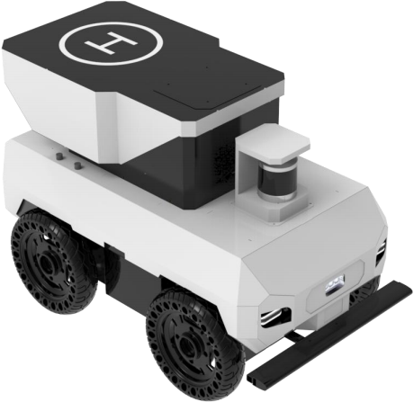
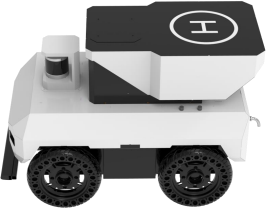

{width="1.3in"
height="1.2933333333333332in"}{width="7.151666666666666in"
height="2.0457075678040244in"}

{width="4.775705380577428in"
height="4.647715441819773in"}

> {width="2.3699989063867015in"
> height="2.361665573053368in"}***SeaRobot01*** ***系列***
>
> 四轮差速标准底盘
>
> **室内外全地形移动导航无人机平台**

{width="5.6498567366579175in"
height="1.7211242344706912in"}

> **产品介绍**

{width="8.26736111111111in"
height="4.0e-2in"}

> SeaRobot 01系列无人车是一款基于室内外全地形的自主移动机器人底盘，
> 其主要针对室外越野、 农业、 园区等场景。 SeaRobot
> 01系列无人车适配四套直 流无刷伺服电机 ，四个轮子均可以独立控制速度。
> 整车VCU基于ARM的控制板， 不但可以控制车辆运动行驶
> ，还能直接反馈各个轮子速度 ，电量电压和相关的车 辆状态。 SeaRobot
> 01系列无人车支持巡航点设置和绘制功能、 轨迹点设置功能 和轨迹录制功能、
> 地图构建与地图切换、 激光自动回充功能以及后台管理等。

{width="2.7599814085739283in"
height="2.1701410761154856in"}

> **产品参数**

{width="8.26736111111111in"
height="4.0e-2in"}

+----------+--------+---------+------------+-----------+-------------+
| >        |        | >       |            | > **最    | >           |
| **尺寸** |        |  **电池 |            | 大速度**  |  **1.2M/S** |
| >        |        | 类型**  |            |           |             |
|  **1072\ |        | > **锂  |            |           |             |
| *617\*72 |        | 电池**  |            |           |             |
| 0（mm)** |        |         |            |           |             |
+----------+--------+---------+------------+-----------+-------------+
| > **底   | > **   | > *     |            | > **转    | > **原地    |
| 盘质量** | 80KG** | *电池容 |            | 弯半径**  | 旋转（0°)** |
|          |        | 量（可  |            |           |             |
|          |        | 扩容)** |            |           |             |
|          |        | >       |            |           |             |
|          |        | **48V** |            |           |             |
|          |        | > *     |            |           |             |
|          |        | *20AH** |            |           |             |
+----------+--------+---------+------------+-----------+-------------+
| >        | > **   | > *     | > **2H**   | > **垂    | > **80KG**  |
| **材料** | Q235** | *续航** |            | 直负载**  |             |
+----------+--------+---------+------------+-----------+-------------+
| > **离   | > **1  | > *     | > **48V**  | >         | > **15%**   |
| 地高度** | 05MM** | *电压** |            |  **爬坡** |             |
+----------+--------+---------+------------+-----------+-------------+
| >        | > **5  | >       | > **3H**   | > *       | > **10CM**  |
| **轮距** | 40MM** |  **充电 |            | *越障（垂 |             |
|          |        | 时间**  |            | 直台阶)** |             |
+----------+--------+---------+------------+-----------+-------------+
| >        | > **3  | >       | > *        | >         | > *         |
| **轮径** | 15MM** |  **充电 | *自动充电/ |  **驻坡** | *伺服驻坡** |
|          |        | 方式**  | 手动充电** |           |             |
+----------+--------+---------+------------+-----------+-------------+
| >        | > **5  | >       | > **支持** | > **对    | > **48V/24  |
| **轴距** | 50MM** |  **电池 |            | 外供电**  | V/19V/12V** |
|          |        | 快拆**  |            |           |             |
+----------+--------+---------+------------+-----------+-------------+
| > **防   | > **   | > *     | **支持（4  | > **控    | >           |
| 护等级** | IP54** | *电池BM | 85通讯）** | 制模式**  | **232串口** |
|          |        | S数据** |            |           |             |
+----------+--------+---------+------------+-----------+-------------+
| > **使   | >      | >       | > **4个**  | > **系    | > **ROS/W   |
| 用温度** |  **-10 |  **电机 |            | 统支持**  | IN/UBUNTU** |
|          | -60°** | 个数**  |            |           |             |
+----------+--------+---------+------------+-----------+-------------+
| > **电   | >      | > *     | >          | > **急    | > **支持**  |
| 机功率** |  **400 | *编码器 | **1000线** | 停按钮**  |             |
|          | W\*4** | 线数**  |            |           |             |
+----------+--------+---------+------------+-----------+-------------+
| > **电机 | >      | > **遥  | > **2.     | > *       | > **支持**  |
| 减速比** |  **1** | 控器**  | 4G遥控器** | *防撞杆** |             |
|          | > **   |         |            |           |             |
|          | ：40** |         |            |           |             |
+----------+--------+---------+------------+-----------+-------------+

+--------------------------------------------------+-------------------+
| > **底盘配件配件清单**                           |                   |
+--------------------------------------------------+-------------------+
| > **机器人本体**                                 | > **1套**         |
+--------------------------------------------------+-------------------+
| > **锂电池充电器（AC220V）**                     | > **1套**         |
+--------------------------------------------------+-------------------+
| > **对外供电模块**                               | > **1套**         |
+--------------------------------------------------+-------------------+
| > **2.4G航模遥控器**                             | > **1套**         |
+--------------------------------------------------+-------------------+
| > **供电插头**                                   | > **1套**         |
+--------------------------------------------------+-------------------+
