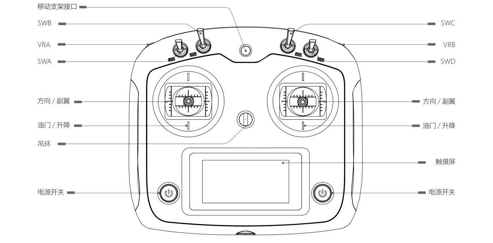

# 操作说明

## 遥控器操作

### 遥控器功能介绍

- **电源开关**：同时按下左右两边电源开关开启/关闭遥控器
- **SWA**：速度档位切换开关
  - 上方：全速模式
  - 下方：半速模式
- **SWB**：模式切换开关
  - 下方：遥控模式
  - 中间：CAN/串口（RS232）控制模式
  - 上方：触发自动回充
- **SWD**：遥控急停开关
  - 上方：触发急停
  - 下方：解除急停
  - 注意：当遥控开启时，若拨到上方，遥控和CAN均不可控制底盘
- **左摇杆**：前/后拨动控制底盘前进/后退
- **右摇杆**：左/右拨动控制底盘左/右转向

::: info 提示
SWC、VRA、VRB暂未使用。遥控背后左右两侧按键无功能。
:::

## 基本操作流程

### 启动步骤

1. 按下开关面板电源按钮，蜂鸣器响一声即开机完成
2. 检查电压表显示电压，若电压低于45V，应停止使用并充电
3. 若蜂鸣器一直鸣响，即为车辆故障，应停止使用

### 遥控操作步骤

1. 开启底盘电源，解除底盘急停
2. 开启遥控器电源开关，等待触摸屏亮起
   - 开机前SWA，SWB，SWC，SWD需要全部拨到最上方
   - 若不在最上方触摸屏会有提示，此时全部拨到最上方即可
3. 把SWB拨到下方（遥控模式），把SWD拨到下方（解除遥控急停）
4. 操作方法：
   - 左摇杆前/后：控制底盘前进和后退
   - 右摇杆左/右：控制底盘左/右转向
   - SWA：切换高速/低速档

### 急停操作

可通过以下两种方式进行急停：
- 按下底盘尾部红色急停按钮
- 把遥控SWD开关拨到上方

### 关闭电源

按下开关面板电源按钮即可。

::: warning 注意
非紧急情况请勿在底盘行走时关闭电源。
:::

## 防撞条功能

当在运动中撞击到物体时，底盘会紧急停车，上位机通讯和遥控器均不能操作。解除碰撞状态方法如下：

1. 按下底盘急停按键后再解除急停
2. 使用遥控器SWD开关急停后再解除急停
3. 使用上位机通讯下发解除指令

## 充电说明

底盘采用48V电池，电压范围45 - 54.6V，当电压低于45V时应停止使用并充电。

### 普通充电流程

1. 关闭底盘电源
2. 先将充电器插入底盘充电接口中，然后将充电器连接到220V插座上
3. 充电过程中充电器指示灯为红色，充电完成后指示灯转为绿色
4. 若需要中途停止充电，需要先断开220V电源，再从底盘拔除充电器

### 自动回充功能

当底盘电压较低但仍能正常动作时（建议电压大于46V），若装有自动回充模块，可使用以下两种方式进行自动回充：

#### 上位机控制回充
1. 按照正常操作流程启动底盘
2. 使用遥控控制底盘前往回充桩正前方大约1米处停下，然后关闭遥控器
3. 上位机发送启动回充命令
4. 底盘自动前往回充桩进行充电
5. 若需要退出回充模式，上位机发送停止回充命令即可

#### 遥控控制回充
1. 按照正常操作流程启动底盘
2. 使用遥控控制底盘前往回充桩正前方大约1米处停下
3. 遥控开关SWB切换到最上的自动回充模式
4. 底盘自动前往回充桩进行充电（此时可以关闭遥控器）
5. 若需要退出回充模式，把遥控开关SWB拨回最下遥控模式即可

## 灯光指示说明

- **底盘故障**：所有灯均为红色常亮
- **异常状态**：状态灯红色常亮
  - 遥控急停
  - 软件急停
  - 急停按键按下
  - 防撞杆触发
- **正常状态**：
  - 状态灯为绿色常亮
  - 转向灯随转向方向闪烁 